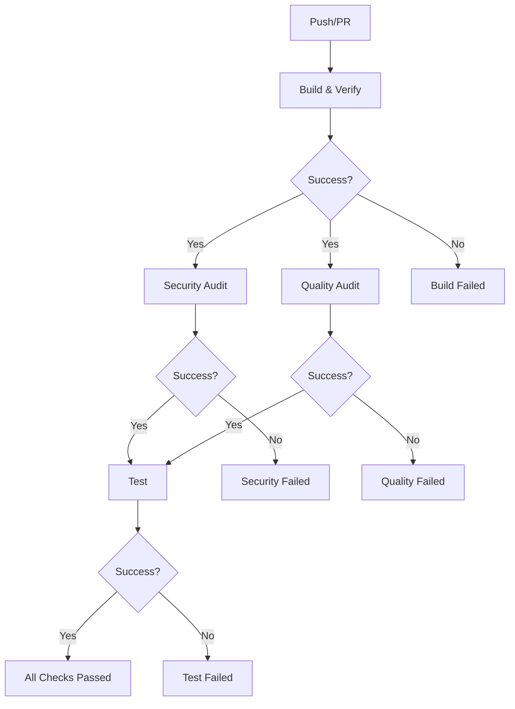

# CI/CDセキュリティワークフロー（v0.8.0）

## 概要

Rimor v0.8.0では、CI/CDパイプラインを4つの独立したジョブに再構築し、セキュリティと品質保証を強化しました。この設計により、各ステージの責任範囲が明確化され、並列実行による高速化と問題の早期発見が可能になります。

## ワークフロー構成

### 1. Build and Verification（ビルドと基本検証）

**目的**: コードのコンパイルと基本的な構文検証

**実行内容**:
- 依存関係のインストール（`npm ci`）
- TypeScriptのビルド（`npm run build`）
- 型チェック（`npx tsc --noEmit`）
- ビルド成果物のアップロード

**並列実行**: Node.js 18.xと20.xで同時実行

### 2. Security Audit（セキュリティ監査）

**目的**: 包括的なセキュリティ脆弱性の検出

**実行内容**:
- **npm audit**: 依存関係の既知の脆弱性チェック
  - 高レベル以上の脆弱性を検出
  - 詳細な監査レポートを生成
- **TaintTyper解析**: 型ベースセキュリティ解析
  - テストコードのセキュリティパターン検出
  - 型推論によるデータフロー追跡
  - ゼロランタイムオーバーヘッドの静的解析

**出力**:
- `audit-results.json`: npm監査結果
- `security-analysis-report.json`: TaintTyper解析結果

### 3. Quality Audit（品質監査）

**目的**: Dogfoodingによる自己診断と品質評価

**実行内容**:
- **自己解析**: Rimor自身でRimorのコードを解析
  - ソースコード品質分析
  - テストコード品質分析
- **品質スコア算出**: 5次元評価
  - カバレッジ（25%）
  - 複雑度（20%）
  - 保守性（20%）
  - セキュリティ（25%）
  - テスト品質（10%）
- **トレンド分析**: 履歴データとの比較
- **改善提案**: 具体的な改善推奨事項の生成

**品質閾値**:
- 総合スコア: 70点以上
- セキュリティスコア: 85点以上
- カバレッジスコア: 60点以上

### 4. Test（テスト実行）

**目的**: 単体・統合テストの実行

**前提条件**: Security AuditとQuality Auditの両方が成功

**実行内容**:
- 全テストスイートの実行（`npm test`）
- メモリ最適化設定（`--max-old-space-size=2048`）
- AIエラーレポートの生成（失敗時）
- PR へのエラーサマリー投稿（失敗時）

## セキュリティ機能の詳細

### TaintTyper型ベースセキュリティ解析

TaintTyperは、Rimorに統合された先進的なセキュリティ解析システムです：

**主な機能**:
1. **型推論によるデータフロー追跡**
   - ユーザー入力から出力までのデータフローを型で追跡
   - 潜在的なインジェクション脆弱性の検出

2. **コンパイル時解析**
   - 実行時オーバーヘッドなし
   - CI/CD時にのみ実行される静的解析

3. **並列解析**
   - マルチコアCPUを活用した高速解析
   - 大規模プロジェクトでもスケーラブル

**検出可能な脆弱性**:
- SQLインジェクション
- XSS（クロスサイトスクリプティング）
- 認証・認可の不備
- 安全でないデータサニタイゼーション

### Dogfooding品質監査

Rimorの「自己診断」機能により、継続的な品質改善を実現：

**評価指標**:
- **カバレッジ**: テストの網羅性
- **複雑度**: コードの簡潔性
- **保守性**: 問題の深刻度分布
- **セキュリティ**: 重大な脆弱性の有無
- **テスト品質**: テストコード自体の品質

**自己改善サイクル**:
1. Rimorが自身のコードを解析
2. 品質スコアと改善提案を生成
3. 開発者が提案に基づき改善
4. 次回のCIで改善効果を測定

## 実行フロー



## ローカル実行方法

開発者はローカルでも各チェックを実行できます：

```bash
# セキュリティチェック
npm run security-check

# 品質監査（dogfooding）
node scripts/quality-audit.js

# フルチェック（セキュリティ + 品質）
npm run full-check
```

## トラブルシューティング

### セキュリティチェックが失敗する場合

1. **npm audit失敗**:
   ```bash
   npm audit fix  # 自動修正を試行
   npm audit      # 詳細を確認
   ```

2. **TaintTyper解析失敗**:
   - `security-analysis-report.json`を確認
   - 検出された問題の詳細を確認
   - 該当するテストコードを修正

### 品質監査が失敗する場合

1. **品質スコアが閾値未満**:
   - `.rimor/reports/dogfooding-report.json`を確認
   - 改善推奨事項に従って修正

2. **ビルドエラー**:
   - `npm run build`が成功することを確認
   - TypeScriptのコンパイルエラーを解決

## 設定のカスタマイズ

### 品質閾値の調整

`scripts/quality-audit.js`の`checkQualityThresholds`関数で調整可能：

```javascript
const thresholds = {
  overall: 70,      // 総合スコア閾値
  security: 85,     // セキュリティスコア閾値
  coverage: 60      // カバレッジスコア閾値
};
```

### TaintTyper設定

`scripts/security-check.js`の`runTaintTypeAnalysis`関数で調整可能：

```javascript
const engine = new TypeBasedSecurityEngine({
  strictness: 'strict',     // 'strict' | 'moderate' | 'lenient'
  maxAnalysisTime: 60000,   // タイムアウト（ミリ秒）
  parallelism: 4,           // 並列度
  enableCache: false        // キャッシュの有効/無効
});
```

## 今後の拡張予定

1. **セキュリティベンチマーク**: 業界標準との比較
2. **自動修正提案**: AIによる修正コード生成
3. **カスタムルール**: プロジェクト固有のセキュリティルール定義
4. **ダッシュボード**: 品質メトリクスの可視化

## 関連ドキュメント

- [TaintTyper実装詳細](./rimor-v0.7.0-security-requirements.md)
- [品質スコアシステム](./api-specification.md#quality-scoring)
- [AIエラーレポーティング](./ai-error-reporting.md)