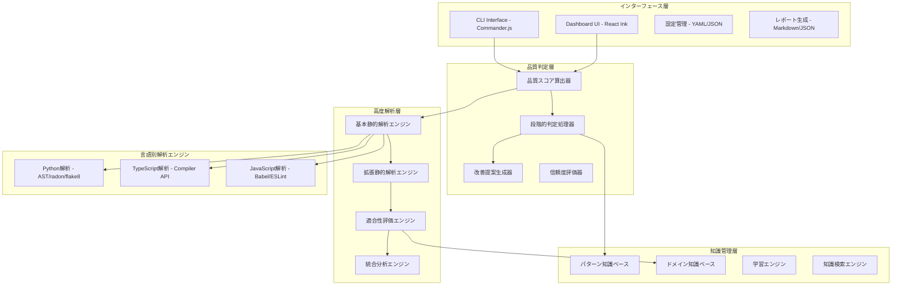

[TOC]
# 静的解析中心のテスト品質監査システム設計レポート（改訂版）

## 1. 概要・設計思想

### 1.1 システム概要

本レポートは、膨大な数のテストコードの品質を効率的に監査するシステムの設計を提案します。**静的解析70-75%＋知識ベース15-20%＋人間判断10%**により、テストの技術的品質と実装機能への適合性を自動検証し、継続的品質改善プロセスを確立します。

**核心価値**
- 静的解析による確実で一貫した品質評価（精度70-75%）
- 高度な解析技術による検出範囲の最大化
- 知識ベースによる文脈理解と限界補完
- npx配布によるゼロインストール体験

### 1.2 設計原則

**現実的な処理分担**
```
70-75% 静的解析: 構造・技術・カバレッジの確実な評価
15-20% 知識照合: ドメイン知識とパターンマッチング
10%    人間判断: ビジネス価値と戦略的判断
```

**静的解析の能力と限界の明確化**
```
■ 確実に評価可能（60%）
├─ 構造的品質（20%）: パターン、命名、アサーション
├─ 技術的品質（25%）: 複雑度、依存関係、コードスメル
└─ カバレッジ（15%）: 実装-テストマッピング

■ 拡張技術で評価可能（10-15%）
├─ データフロー解析（5%）: 変数使用パターン
├─ シンボリック実行（5%）: 簡単な実行パス検証
└─ ドキュメント解析（5%）: 意図の抽出

■ 静的解析では困難（25-30%）
├─ ビジネス適合性（15%）: ドメイン知識必須
├─ 動的振る舞い（10%）: 実行時検証必須
└─ 統合妥当性（5%）: E2Eテストの適切性
```

### 1.3 適合性評価の必要性（Why）

**根本的な問題**
- "正しく書かれたテスト" ≠ "正しいものをテストしているテスト"
- 構造的に完璧でも、ビジネス価値がないテストは無意味

**具体例：認証機能のテスト**
```yaml
静的解析で検出可能:
  - パスワード検証ロジックの存在 ✓
  - エラーハンドリングの実装 ✓
  - テスト構造の適切性 ✓

静的解析では検出困難:
  - パスワードポリシーの妥当性（8文字で十分か？）✗
  - セキュリティ要件の充足性（ブルートフォース対策は？）✗
  - ビジネスルールとの整合性（ロックアウト仕様は？）✗
```

## 2. システムアーキテクチャ

### 2.1 全体アーキテクチャ



### 2.2 高度な静的解析エンジン設計

**基本静的解析（60%カバレッジ）**
```python
class BasicStaticAnalyzer:
    def analyze_structural_quality(self, ast):
        # テスト構造パターン検証
        pattern_score = self.check_test_patterns(ast)
        # 命名規約・可読性評価
        naming_score = self.check_naming_conventions(ast)
        # アサーション密度・配置分析
        assertion_score = self.analyze_assertions(ast)
        return combine_scores(pattern_score, naming_score, assertion_score)
    
    def analyze_technical_quality(self, ast):
        # 複雑度メトリクス（循環的・認知的）
        complexity = self.calculate_complexity(ast)
        # コードスメル検出
        smells = self.detect_code_smells(ast)
        # 依存関係の健全性
        dependencies = self.analyze_dependencies(ast)
        return evaluate_technical_quality(complexity, smells, dependencies)
```

**拡張静的解析（10-15%追加カバレッジ）**
```python
class AdvancedStaticAnalyzer:
    def analyze_with_type_info(self, ast, type_info):
        """TypeScript型情報を活用した深い解析"""
        # 型シグネチャから必要テストケースを推論
        required_cases = self.infer_test_cases_from_types(type_info)
        # Union型、ジェネリック型の境界値検出
        boundary_cases = self.detect_type_boundaries(type_info)
        # 型カバレッジ評価
        coverage = self.evaluate_type_coverage(ast, required_cases)
        return TypeAnalysisResult(required_cases, boundary_cases, coverage)
    
    def analyze_data_flow(self, ast):
        """データフロー解析による意図推定"""
        # 変数の生成・変換・検証フロー追跡
        flow_graph = self.build_data_flow_graph(ast)
        # テスト意図のパターンマッチング
        intent = self.infer_test_intent(flow_graph)
        # 不要な処理や抜け漏れの検出
        issues = self.detect_flow_issues(flow_graph)
        return DataFlowResult(intent, issues)
    
    def analyze_documentation(self, source_file):
        """ドキュメントからの文脈理解"""
        # JSDoc、docstring、コメント解析
        docs = self.extract_documentation(source_file)
        # 自然言語処理による要件抽出
        requirements = self.nlp_extract_requirements(docs)
        # テストとの整合性検証
        alignment = self.verify_test_alignment(requirements)
        return DocumentationResult(requirements, alignment)
```

## 3. 段階的品質判定システム

### 3.1 信頼度ベースの判定設計

```yaml
静的解析による自動判定（75%）:
  高信頼度判定（50%）:
    対象:
      - 明確な構造違反
      - 基本的品質メトリクス不足
      - 明白なカバレッジ不足
    判定精度: 95%以上
    自動承認閾値: 品質スコア0.8以上
    
  中信頼度判定（20%）:
    対象:
      - 複雑なパターンマッチング結果
      - データフロー解析による推論
      - ドキュメント整合性評価
    判定精度: 80-90%
    人間確認推奨: 品質スコア0.6-0.8
    
  低信頼度判定（5%）:
    対象:
      - ヒューリスティックな推論
      - 類似パターンからの推定
      - 複雑な統合テスト評価
    判定精度: 70-80%
    専門家レビュー必須: 品質スコア0.6未満

人間判断必須領域（25%）:
  ドメイン知識評価（15%）:
    - ビジネスルールの妥当性検証
    - 業界標準・規制への準拠確認
    - プロジェクト固有要件の充足性
    
  実行時検証（10%）:
    - パフォーマンステストの適切性
    - 統合テストの実効性
    - 非決定的動作の扱い
```

### 3.2 構造品質パターンと評価基準

**利用可能パターンと特性**

| パターンID | 名称 | 静的解析適合度 | 推奨使用場面 |
|------------|------|----------------|--------------|
| `aaa` | AAA Pattern | ★★★★★ | 標準開発、新人教育 |
| `bdd` | BDD Style | ★★★★☆ | 要件駆動開発 |
| `four_phase` | Four-Phase | ★★★★☆ | リソース管理重視 |
| `functional` | Functional | ★★★☆☆ | 関数型プログラミング |
| `minimal` | Minimal | ★★☆☆☆ | 小規模・高速開発 |
| `enterprise` | Enterprise | ★★★★★ | 大規模・規制対応 |

**パターン別の静的解析重み調整**
```
AAA:        構造30% + 技術25% + カバレッジ25% + 適合性15% + 保守性5%
BDD:        構造25% + 技術20% + カバレッジ25% + 適合性25% + 保守性5%
Enterprise: 構造25% + 技術20% + カバレッジ30% + 適合性20% + 保守性5%
Functional: 構造15% + 技術35% + カバレッジ25% + 適合性20% + 保守性5%
```

## 4. 知識管理システム

### 4.1 静的解析の限界を補完する知識活用

**知識ベースの役割**
```yaml
静的解析の限界補完:
  パターンライブラリ:
    業界別テストパターン:
      - 金融: トランザクション整合性、監査証跡
      - 医療: HIPAA準拠、データプライバシー
      - EC: 在庫管理、決済フロー
    
    フレームワーク別ベストプラクティス:
      - React: コンポーネントテスト、フック
      - Django: モデル検証、ビュー統合
      - Spring: DIコンテナ、トランザクション
    
    アンチパターンカタログ:
      - 過度なモック使用
      - 実装詳細への依存
      - 脆弱なセレクタ使用

  コンテキスト知識:
    プロジェクト仕様:
      - ビジネスルール定義
      - 非機能要件（性能、セキュリティ）
      - 外部システム連携仕様
    
    チーム規約:
      - コーディング規約
      - テスト戦略
      - 品質基準
```

### 4.2 学習による静的解析精度向上

**継続的改善メカニズム**
```python
class LearningEngine:
    def learn_from_feedback(self, test_file, human_judgment, analysis_result):
        """人間のフィードバックから学習"""
        # 静的解析の判定と人間判断の差分分析
        gap = self.analyze_judgment_gap(analysis_result, human_judgment)
        
        # パターン抽出と知識更新
        if gap.is_significant():
            pattern = self.extract_pattern(test_file, gap)
            self.update_knowledge_base(pattern)
            
        # 解析アルゴリズムの重み調整
        self.adjust_analysis_weights(gap)
        
    def improve_detection_patterns(self):
        """検出パターンの継続的改善"""
        # 成功事例からの学習
        success_patterns = self.analyze_high_quality_tests()
        # 失敗事例からの学習
        failure_patterns = self.analyze_low_quality_tests()
        # 新しい検出ルールの生成
        new_rules = self.generate_detection_rules(
            success_patterns, 
            failure_patterns
        )
        return new_rules
```

## 5. 実装適合性評価システム

### 5.1 静的解析による適合性評価の拡張

**実装コードとテストコードの深い相関分析**
```python
class ImplementationAlignmentAnalyzer:
    def analyze_test_implementation_alignment(self, test_ast, impl_ast):
        """実装とテストの整合性を静的に分析"""
        # 実装の公開APIとテストの呼び出し対応
        api_coverage = self.analyze_api_coverage(test_ast, impl_ast)
        
        # エラーパスのカバレッジ
        error_coverage = self.analyze_error_path_coverage(test_ast, impl_ast)
        
        # ビジネスロジックの分岐網羅
        branch_coverage = self.analyze_branch_coverage(test_ast, impl_ast)
        
        # 境界値テストの自動検出
        boundary_tests = self.detect_boundary_value_tests(test_ast, impl_ast)
        
        return AlignmentScore(
            api_coverage,
            error_coverage,
            branch_coverage,
            boundary_tests
        )
    
    def infer_missing_tests(self, impl_ast, existing_tests):
        """実装から不足テストを推論"""
        # 実装の全パスを抽出
        all_paths = self.extract_execution_paths(impl_ast)
        
        # 既存テストでカバーされているパス
        covered_paths = self.analyze_covered_paths(existing_tests)
        
        # 不足しているテストケースの生成
        missing_tests = self.generate_missing_test_cases(
            all_paths - covered_paths
        )
        
        return missing_tests
```

### 5.2 ドメイン知識を活用した適合性評価

**知識ベースによる文脈理解**
```yaml
ドメイン特化評価ルール:
  認証・認可:
    必須テストケース:
      - 有効な認証情報での成功
      - 無効な認証情報での失敗
      - トークン有効期限切れ
      - 権限不足エラー
      - ブルートフォース防御
    
  金融取引:
    必須テストケース:
      - トランザクション整合性
      - 同時実行制御
      - 監査ログ生成
      - 金額計算精度
      - 規制準拠チェック
    
  データ処理:
    必須テストケース:
      - 大量データ処理
      - エッジケース（空、null）
      - 文字エンコーディング
      - データ整合性検証
      - エラーリカバリ
```

## 6. インターフェース・ユーザー体験

### 6.1 解析結果の信頼度表示

**CLI出力の改善**
```bash
$ npx test-quality-audit analyze tests/

📊 テスト品質監査レポート
═══════════════════════════════════════════════════════════

tests/auth/login.test.ts
├─ 総合品質スコア: 0.82 [高信頼度 ★★★★★]
├─ 静的解析カバレッジ: 72%
│  ├─ 構造的品質: 0.90 ✓ [信頼度: 95%]
│  ├─ 技術的品質: 0.85 ✓ [信頼度: 92%]
│  ├─ カバレッジ: 0.75 ⚠ [信頼度: 88%]
│  └─ 適合性評価: 0.70 ⚠ [信頼度: 75%]
├─ 知識ベース評価: 認証パターンに準拠
└─ 推奨事項:
   - 境界値テストの追加を推奨
   - エラーケースのカバレッジ向上が必要

tests/payment/transaction.test.ts
├─ 総合品質スコア: 0.65 [中信頼度 ★★★☆☆]
├─ 静的解析カバレッジ: 68%
├─ ⚠ 人間によるレビューを推奨
│  └─ 理由: 金融ドメイン特有の要件確認が必要
└─ 検出された問題:
   - トランザクション整合性テストが不足
   - 同時実行シナリオが未検証
```

### 6.2 段階的導入のためのモード設計

**運用モード**
```yaml
導入段階別モード:
  learning_mode:
    説明: 既存テストから学習し、基準を調整
    静的解析: 情報提供のみ
    判定: 人間が100%判断
    
  assisted_mode:
    説明: 静的解析を参考に人間が判断
    静的解析: 推奨事項を提示
    判定: 人間が最終判断
    
  automated_mode:
    説明: 高信頼度のみ自動化
    静的解析: 高信頼度は自動承認
    判定: 中・低信頼度は人間確認
    
  full_automation:
    説明: 完全自動化（成熟組織向け）
    静的解析: 全て自動判定
    判定: 例外のみ人間介入
```

## 7. 技術実装詳細

### 7.1 言語別の高度な静的解析実装

**Python向け拡張解析**
```python
class PythonAdvancedAnalyzer:
    def __init__(self):
        self.ast_analyzer = ast.parse
        self.complexity_analyzer = radon.complexity
        self.type_analyzer = mypy.api  # 型ヒント活用
        
    def analyze_with_type_hints(self, source_code):
        """型ヒントを活用した高度な解析"""
        # mypyを使った型情報の抽出
        type_info = self.extract_type_info(source_code)
        
        # 型情報からテストケースを推論
        test_cases = self.infer_test_cases_from_types(type_info)
        
        # Pythonicなパターンの検出
        pythonic_score = self.check_pythonic_patterns(source_code)
        
        return PythonAnalysisResult(type_info, test_cases, pythonic_score)
```

**TypeScript向け拡張解析**
```typescript
class TypeScriptAdvancedAnalyzer {
    private program: ts.Program;
    private checker: ts.TypeChecker;
    
    analyzeWithFullTypeInfo(sourceFile: ts.SourceFile) {
        // 型システムを最大限活用
        const typeInfo = this.extractCompleteTypeInfo(sourceFile);
        
        // ジェネリック型の境界値分析
        const genericBoundaries = this.analyzeGenericBoundaries(typeInfo);
        
        // Union/Intersection型の完全性チェック
        const unionCoverage = this.checkUnionTypeCoverage(typeInfo);
        
        // 型ガードの適切性評価
        const typeGuardQuality = this.evaluateTypeGuards(sourceFile);
        
        return {
            typeCompleteness: this.calculateTypeCompleteness(typeInfo),
            genericCoverage: genericBoundaries,
            unionCoverage: unionCoverage,
            typeGuardQuality: typeGuardQuality
        };
    }
}
```

### 7.2 パフォーマンス最適化

**並列処理とキャッシング**
```javascript
class OptimizedAnalyzer {
    constructor() {
        this.cache = new LRUCache({ max: 1000 });
        this.workerPool = new WorkerPool({ size: os.cpus().length });
    }
    
    async analyzeProject(projectPath) {
        // ファイルレベルの並列処理
        const files = await this.findTestFiles(projectPath);
        
        // キャッシュヒット率の最適化
        const cachedResults = files.map(f => this.cache.get(f.hash));
        const uncachedFiles = files.filter((f, i) => !cachedResults[i]);
        
        // Worker Poolでの並列解析
        const newResults = await this.workerPool.map(
            uncachedFiles,
            file => this.analyzeFile(file)
        );
        
        // インクリメンタル解析
        return this.mergeResults(cachedResults, newResults);
    }
}
```

## 8. 導入効果と成功指標

### 8.1 現実的な効果目標

**静的解析による効果**
```yaml
定量的効果:
  自動化率:
    目標: 70-75%のテスト品質判定を自動化
    現実的達成値: 6ヶ月で60%、1年で70%
    
  レビュー時間削減:
    目標: 30-40%の時間削減
    内訳: 
      - 明らかな問題の自動検出: 20%
      - 構造的レビューの自動化: 10-20%
    
  品質向上:
    目標: テスト品質スコア平均20%向上
    測定: 導入前後の品質メトリクス比較

定性的効果:
  - チーム内の品質基準統一
  - 新人の学習曲線短縮
  - ベストプラクティスの浸透
  - 技術的負債の可視化
```

### 8.2 段階的成功指標

**フェーズ別KPI**
```yaml
Phase 1 (0-3ヶ月):
  - 基本的な構造品質の自動評価: 50%達成
  - 誤検知率: 30%以下
  - ユーザー満足度: 3.0/5.0
  
Phase 2 (3-6ヶ月):
  - 拡張静的解析の活用: 60%カバレッジ
  - 誤検知率: 20%以下
  - 適合性評価の精度: 70%
  
Phase 3 (6-12ヶ月):
  - 総合的な自動化率: 70%
  - 誤検知率: 15%以下
  - ROI: レビュー工数30%削減
```

## 9. リスク分析と対策

### 9.1 技術的リスクと現実的な対策

**静的解析の限界に関するリスク**
```yaml
リスク:
  過度な期待:
    問題: 静的解析で100%カバーできると期待
    対策: 
      - 明確な限界の事前説明
      - 段階的な導入計画
      - 継続的な期待値調整
      
  複雑な動的振る舞い:
    問題: 非同期処理、副作用の評価困難
    対策:
      - 限定的なシンボリック実行
      - パターンベースの推論
      - 人間レビューとの併用
      
  新技術への対応:
    問題: 新フレームワーク、言語機能
    対策:
      - プラグイン可能なアーキテクチャ
      - コミュニティ駆動の拡張
      - 定期的なアップデート
```

### 9.2 組織的リスクと対策

**導入障壁と克服方法**
```yaml
文化的抵抗:
  問題: "機械に品質判定されたくない"
  対策:
    - 支援ツールとしての位置づけ明確化
    - 成功事例の共有
    - 段階的な信頼構築
    
学習コスト:
  問題: 新しい品質基準の理解
  対策:
    - インタラクティブなガイド
    - 既存コードからの学習
    - チーム別カスタマイズ
```

## 10. まとめ

### 10.1 現実的な価値提案

本システムは、**静的解析技術の現実的な能力（70-75%）を最大限活用**し、知識ベースと人間の判断で補完することで、実用的なテスト品質監査を実現します。

**主要な改善点**
- 静的解析の能力と限界を明確化（90%→70-75%）
- 適合性評価の必要性を具体例で説明
- 高度な静的解析技術による検出範囲拡大
- 信頼度ベースの段階的判定システム

**期待される成果**
- 現実的な自動化率（70-75%）の達成
- 段階的導入による組織への定着
- 継続的な学習による精度向上
- 開発効率と品質の両立

この設計により、技術的に実現可能で、組織的に受け入れられやすい、持続可能なテスト品質監査システムを構築できます。