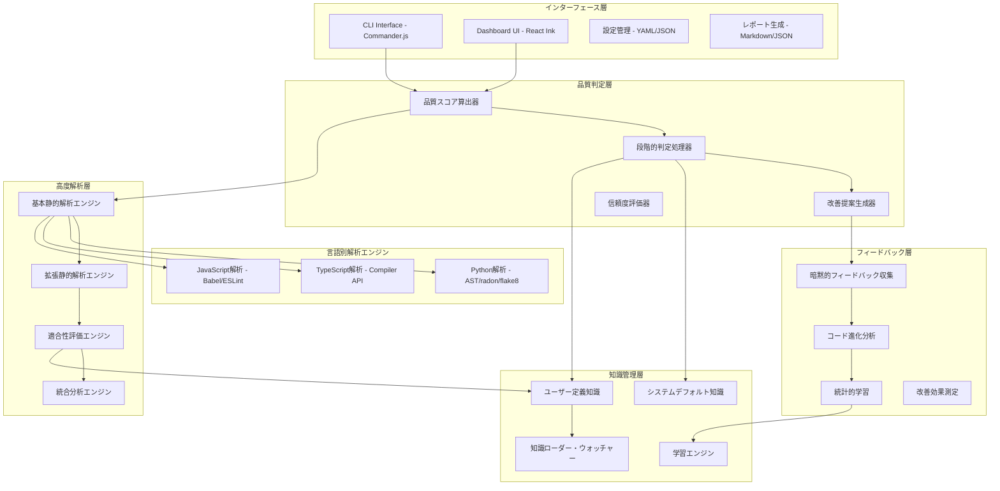

[TOC]
# 静的解析中心のテスト品質監査システム設計レポート（改訂版）

## 1. 概要・設計思想

### 1.1 システム概要

本レポートは、膨大な数のテストコードの品質を効率的に監査するシステムの設計を提案します。**静的解析70-75%＋知識ベース15-20%＋人間判断10%**により、テストの技術的品質と実装機能への適合性を自動検証し、継続的品質改善プロセスを確立します。

**核心価値**
- 静的解析による確実で一貫した品質評価（精度70-75%）
- ユーザー定義ナレッジの即時反映による組織固有知識の活用
- 暗黙的フィードバックによる継続的改善
- OSSとしての実用性と持続可能性

### 1.2 設計原則

**現実的な処理分担**
```
70-75% 静的解析: 構造・技術・カバレッジの確実な評価
15-20% 知識照合: ドメイン知識とパターンマッチング
10%    人間判断: ビジネス価値と戦略的判断
```

**静的解析の能力と限界の明確化**
```
■ 確実に評価可能（60%）
├─ 構造的品質（20%）: パターン、命名、アサーション
├─ 技術的品質（25%）: 複雑度、依存関係、コードスメル
└─ カバレッジ（15%）: 実装-テストマッピング

■ 拡張技術で評価可能（10-15%）
├─ データフロー解析（5%）: 変数使用パターン
├─ シンボリック実行（5%）: 簡単な実行パス検証
└─ ドキュメント解析（5%）: 意図の抽出

■ 静的解析では困難（25-30%）
├─ ビジネス適合性（15%）: ドメイン知識必須
├─ 動的振る舞い（10%）: 実行時検証必須
└─ 統合妥当性（5%）: E2Eテストの適切性
```

### 1.3 適合性評価の必要性（Why）

**根本的な問題**
- "正しく書かれたテスト" ≠ "正しいものをテストしているテスト"
- 構造的に完璧でも、ビジネス価値がないテストは無意味

**具体例：認証機能のテスト**
```yaml
静的解析で検出可能:
  - パスワード検証ロジックの存在 ✓
  - エラーハンドリングの実装 ✓
  - テスト構造の適切性 ✓

静的解析では検出困難:
  - パスワードポリシーの妥当性（8文字で十分か？）✗
  - セキュリティ要件の充足性（ブルートフォース対策は？）✗
  - ビジネスルールとの整合性（ロックアウト仕様は？）✗
```

## 2. システムアーキテクチャ

### 2.1 全体アーキテクチャ



### 2.2 高度な静的解析エンジン設計

**基本静的解析（60%カバレッジ）**
```python
class BasicStaticAnalyzer:
    def analyze_structural_quality(self, ast):
        # テスト構造パターン検証
        pattern_score = self.check_test_patterns(ast)
        # 命名規約・可読性評価
        naming_score = self.check_naming_conventions(ast)
        # アサーション密度・配置分析
        assertion_score = self.analyze_assertions(ast)
        return combine_scores(pattern_score, naming_score, assertion_score)
    
    def analyze_technical_quality(self, ast):
        # 複雑度メトリクス（循環的・認知的）
        complexity = self.calculate_complexity(ast)
        # コードスメル検出
        smells = self.detect_code_smells(ast)
        # 依存関係の健全性
        dependencies = self.analyze_dependencies(ast)
        return evaluate_technical_quality(complexity, smells, dependencies)
```

**拡張静的解析（10-15%追加カバレッジ）**
```python
class AdvancedStaticAnalyzer:
    def analyze_with_type_info(self, ast, type_info):
        """TypeScript型情報を活用した深い解析"""
        # 型シグネチャから必要テストケースを推論
        required_cases = self.infer_test_cases_from_types(type_info)
        # Union型、ジェネリック型の境界値検出
        boundary_cases = self.detect_type_boundaries(type_info)
        # 型カバレッジ評価
        coverage = self.evaluate_type_coverage(ast, required_cases)
        return TypeAnalysisResult(required_cases, boundary_cases, coverage)
    
    def analyze_data_flow(self, ast):
        """データフロー解析による意図推定"""
        # 変数の生成・変換・検証フロー追跡
        flow_graph = self.build_data_flow_graph(ast)
        # テスト意図のパターンマッチング
        intent = self.infer_test_intent(flow_graph)
        # 不要な処理や抜け漏れの検出
        issues = self.detect_flow_issues(flow_graph)
        return DataFlowResult(intent, issues)
    
    def analyze_documentation(self, source_file):
        """ドキュメントからの文脈理解"""
        # JSDoc、docstring、コメント解析
        docs = self.extract_documentation(source_file)
        # 自然言語処理による要件抽出
        requirements = self.nlp_extract_requirements(docs)
        # テストとの整合性検証
        alignment = self.verify_test_alignment(requirements)
        return DocumentationResult(requirements, alignment)
```

## 3. OSS前提での新規性と独自性

### 3.1 既存ツールでは解決できない具体的な問題

**問題1: テストの「形式」と「実効性」のギャップ**
```python
# 既存ツールは「通る」テスト
def test_calculate_price():
    assert calculate_price(100, 0.1) == 90  # ✓ Coverage 100%
    
# でも実際の問題：
# - 負の値は？
# - 小数点以下の丸め誤差は？
# - 通貨が異なる場合は？
# - 税率が null の場合は？
# → 本番で障害が発生してから気づく
```

**問題2: ドメイン知識の属人化**
```yaml
現状:
  新人: "このAPIのテスト、どこまで書けばいいですか？"
  シニア: "あー、これは決済系だから必ず冪等性とタイムアウトと..."
  新人: "...？"
  
  → シニアエンジニアの時間が奪われる
  → チームによって品質にばらつき
  → 知識が文書化されない
```

**問題3: テストコードの技術的負債の不可視性**
```javascript
// 5年前のテスト - まだ動くが...
it('should work', () => {
  // 1000行のセットアップ
  // mockが20個
  // 何をテストしているか不明
  expect(result).toBe(true);
});

// 既存ツール: "Passed! Coverage 95%!" 
// 実態: 保守不可能、価値不明
```

### 3.2 本システムの技術的独自性

**独自技術1: 実装とテストの双方向解析**
```python
class BidirectionalAnalyzer:
    """実装からテストへ、テストから実装への双方向で分析"""
    
    def analyze_implementation_to_test(self, impl_ast):
        # 実装の全実行パスを抽出
        execution_paths = self.extract_all_paths(impl_ast)
        
        # 各パスのリスクレベルを評価
        risk_assessment = self.assess_path_risks(execution_paths)
        
        # 必要なテストケースを生成
        return self.generate_required_tests(risk_assessment)
    
    def analyze_test_to_implementation(self, test_ast):
        # テストが検証している実装箇所を特定
        tested_behaviors = self.extract_tested_behaviors(test_ast)
        
        # 実装の意図との整合性を検証
        alignment = self.verify_intent_alignment(tested_behaviors)
        
        return alignment
```

**独自技術2: コンテキスト認識型パターンマッチング**
```python
class ContextAwarePatternMatcher:
    """同じコードでも文脈によって判断を変える"""
    
    def evaluate_test_quality(self, test_code, context):
        # 例: assert response.status == 200
        
        if context.is_auth_endpoint:
            # 認証エンドポイントなら不十分
            return "401, 403, 429のテストが必要"
            
        elif context.is_payment_api:
            # 決済APIなら致命的に不十分
            return "冪等性、タイムアウト、ロールバックのテストが必須"
            
        elif context.is_static_content:
            # 静的コンテンツなら十分
            return "OK"
```

**独自技術3: 暗黙知の形式知化エンジン**
```yaml
# プロジェクトから自動的に「暗黙のルール」を発見
発見例:
  - "このチームは必ずエラーメッセージの国際化をテストしている"
  - "金額を扱う関数は必ず3つ以上の境界値テストがある"
  - "外部API呼び出しは必ずリトライロジックをテストしている"
  
→ これらを新規コードに対して自動的に適用
```

### 3.3 なぜ既存ツールの組み合わせでは実現できないか

```yaml
ESLint + Coverage + その他:
  限界1: それぞれが独立して動作、統合的な判断ができない
  限界2: ルールが静的、学習しない
  限界3: 実装コードとの関連性を理解できない
  限界4: ドメイン知識を持てない

本システム:
  統合: 実装とテストを統合的に解析
  適応: プロジェクトごとに学習・適応
  理解: コードの意図を理解
  知識: ドメイン知識を蓄積・活用
```

### 3.4 開発者個人/チームが得る具体的価値

**個人開発者にとっての価値**
```bash
$ npx test-quality-audit analyze

⚠ tests/auth.test.js
  行動: ログイン成功のみテストしています
  リスク: よくある本番障害パターンと一致
  提案: 以下のケースを追加してください：
    - パスワード間違い（5回でロックアウト？）
    - ユーザー存在しない（エラーメッセージで存在が分かる？）
    - SQLインジェクション対策（prepare statement使用？）
    
  類似プロジェクトでの事例:
    "このパターンで本番障害が3件報告されています"
```

**チームにとっての価値**
- レビューの議論が「形式」から「本質」へ
- 新人が最初から「チームの暗黙知」に従ったテストを書ける
- テストの保守性問題を定量的に可視化

## 4. ユーザー定義ナレッジの即時反映システム

### 4.1 設計思想

組織固有の知識や規約を、**設定ファイルを配置するだけで即座にシステムに反映**できる仕組みを提供します。再起動不要、学習不要、即座に効果を発揮します。

### 4.2 ディレクトリ構造とファイル配置

```bash
project-root/
├── .test-quality/                    # ユーザー定義ナレッジ
│   ├── patterns/                     # テストパターン定義
│   │   ├── auth-testing.yml         # 認証系テスト規則
│   │   ├── api-testing.yml          # API テスト規則
│   │   └── db-testing.yml           # DB テスト規則
│   ├── rules/                        # カスタムルール
│   │   ├── company-security.yml     # 自社セキュリティ規則
│   │   └── team-conventions.yml     # チーム規約
│   ├── requirements/                 # 必須要件定義
│   │   ├── compliance.yml           # コンプライアンス要件
│   │   └── performance.yml          # 性能要件
│   └── config.yml                   # 全体設定
│
├── src/                             # アプリケーションコード
└── tests/                           # テストコード
```

### 4.3 シンプルなナレッジ定義フォーマット

**パターン定義例（auth-testing.yml）**
```yaml
# 認証系テストのパターン定義
name: "認証テストパターン"
version: "1.0"
applies_to:
  - patterns: ["**/auth/**", "**/login/**", "**/session/**"]
  - keywords: ["authenticate", "login", "logout", "session"]

required_test_cases:
  - id: "valid-credentials"
    description: "有効な認証情報でのログイン成功"
    priority: "critical"
    example: |
      test('should login with valid credentials', () => {
        const result = await login('user@example.com', 'validPass123');
        expect(result.success).toBe(true);
        expect(result.token).toBeDefined();
      });

  - id: "invalid-credentials"
    description: "無効な認証情報でのログイン失敗"
    priority: "critical"
    patterns:
      - "wrong password"
      - "non-existent user"
      - "expired account"

  - id: "rate-limiting"
    description: "ブルートフォース攻撃対策"
    priority: "high"
    condition: "when API is public"
    check: |
      # 5回失敗したらロックアウトされることを確認
      consecutive_failures >= 5 && lockout_tested

anti_patterns:
  - id: "plain-text-password"
    description: "パスワードの平文比較"
    severity: "critical"
    pattern: "password === '.*'"
    message: "パスワードは必ずハッシュ化して比較してください"

quality_checks:
  - id: "token-expiry"
    description: "トークン有効期限のテスト"
    check_for: ["exp", "expires", "ttl"]
    message: "認証トークンの有効期限をテストしてください"
```

**カスタムルール例（company-security.yml）**
```yaml
# 自社固有のセキュリティルール
name: "ACME Corp セキュリティ規則"
version: "2.0"
priority: 100  # 数値が大きいほど優先

rules:
  - id: "pii-handling"
    description: "個人情報の取り扱い"
    applies_to: ["**/user/**", "**/customer/**"]
    must_test:
      - "データマスキング処理"
      - "アクセスログ記録"
      - "暗号化確認"
    
  - id: "audit-trail"
    description: "監査証跡"
    applies_to: ["**/api/**"]
    enforcement: "strict"
    requires:
      - test_name_pattern: "audit|log"
      - assertions:
          - "timestamp記録"
          - "実行ユーザー記録"
          - "変更前後の値記録"

  - id: "data-retention"
    description: "データ保持期間"
    context:
      - "削除機能には必ず論理削除フラグのテストが必要"
      - "物理削除は90日後の確認が必要"
```

### 4.4 即時反映とホットリロード

```python
class KnowledgeLoader:
    def __init__(self, project_root):
        self.project_root = project_root
        self.knowledge_dir = os.path.join(project_root, '.test-quality')
        self.watchers = {}
        self.knowledge_cache = {}
        
    def load_all_knowledge(self):
        """起動時に全ナレッジを読み込み"""
        knowledge = {
            'patterns': self._load_patterns(),
            'rules': self._load_rules(),
            'requirements': self._load_requirements(),
        }
        
        # システムデフォルトとマージ（ユーザー定義が優先）
        return self._merge_with_defaults(knowledge)
    
    def watch_for_changes(self):
        """ファイル変更を監視して自動リロード"""
        for category in ['patterns', 'rules', 'requirements']:
            path = os.path.join(self.knowledge_dir, category)
            if os.path.exists(path):
                self.watchers[category] = FileWatcher(
                    path,
                    on_change=lambda f: self._reload_knowledge(category, f)
                )
    
    def _reload_knowledge(self, category, file_path):
        """変更されたファイルを即座に再読み込み"""
        try:
            new_content = self._parse_yaml(file_path)
            self._validate_format(new_content, category)
            
            # キャッシュ更新
            self.knowledge_cache[category][file_path] = new_content
            
            # 即座に解析エンジンに反映
            self._notify_analyzers(category, new_content)
            
            logger.info(f"ナレッジを更新しました: {file_path}")
        except Exception as e:
            logger.error(f"ナレッジ読み込みエラー: {file_path} - {e}")
            # エラーでもシステムは継続動作
```

### 4.5 優先順位と競合解決

```yaml
# .test-quality/config.yml
# システム全体の設定
knowledge_priority:
  # 数値が大きいほど優先（デフォルト: 50）
  system_defaults: 10
  community_patterns: 30
  user_patterns: 50
  team_rules: 70
  company_rules: 100

conflict_resolution:
  # 同じIDのルールが複数ある場合
  strategy: "highest_priority"  # or "merge", "error"
  
  # マージ戦略の詳細
  merge_rules:
    required_test_cases: "union"  # 全て必須
    anti_patterns: "union"        # 全て禁止
    quality_checks: "override"    # 優先度高が上書き

# 特定ディレクトリへの適用除外
exclusions:
  - "tests/legacy/**"
  - "tests/generated/**"
```

### 4.6 実用的な使用例

**チーム固有のAPI規約**
```yaml
# .test-quality/patterns/team-api-standards.yml
name: "チームAPI規約"
version: "1.0"

required_test_cases:
  - id: "api-error-format"
    description: "エラーレスポンスの形式確認"
    applies_to: ["**/api/**/*.test.js"]
    must_verify:
      status_code: [400, 401, 403, 404, 500]
      response_shape:
        - field: "error.code"
        - field: "error.message"
        - field: "error.details"
    example: |
      expect(errorResponse).toMatchObject({
        error: {
          code: 'VALIDATION_ERROR',
          message: expect.any(String),
          details: expect.any(Array)
        }
      });

  - id: "api-pagination"
    description: "ページネーション仕様"
    applies_to: ["GET リクエストの一覧系API"]
    must_test:
      - "limit パラメータ（最大100）"
      - "offset パラメータ"
      - "total_count の返却"
```

## 5. 段階的品質判定システム

### 5.1 信頼度ベースの判定設計

```yaml
静的解析による自動判定（75%）:
  高信頼度判定（50%）:
    対象:
      - 明確な構造違反
      - 基本的品質メトリクス不足
      - 明白なカバレッジ不足
    判定精度: 95%以上
    自動承認閾値: 品質スコア0.8以上
    
  中信頼度判定（20%）:
    対象:
      - 複雑なパターンマッチング結果
      - データフロー解析による推論
      - ドキュメント整合性評価
    判定精度: 80-90%
    人間確認推奨: 品質スコア0.6-0.8
    
  低信頼度判定（5%）:
    対象:
      - ヒューリスティックな推論
      - 類似パターンからの推定
      - 複雑な統合テスト評価
    判定精度: 70-80%
    専門家レビュー必須: 品質スコア0.6未満

人間判断必須領域（25%）:
  ドメイン知識評価（15%）:
    - ビジネスルールの妥当性検証
    - 業界標準・規制への準拠確認
    - プロジェクト固有要件の充足性
    
  実行時検証（10%）:
    - パフォーマンステストの適切性
    - 統合テストの実効性
    - 非決定的動作の扱い
```

### 5.2 構造品質パターンと評価基準

**利用可能パターンと特性**

| パターンID | 名称 | 静的解析適合度 | 推奨使用場面 |
|------------|------|----------------|--------------|
| `aaa` | AAA Pattern | ★★★★★ | 標準開発、新人教育 |
| `bdd` | BDD Style | ★★★★☆ | 要件駆動開発 |
| `four_phase` | Four-Phase | ★★★★☆ | リソース管理重視 |
| `functional` | Functional | ★★★☆☆ | 関数型プログラミング |
| `minimal` | Minimal | ★★☆☆☆ | 小規模・高速開発 |
| `enterprise` | Enterprise | ★★★★★ | 大規模・規制対応 |

**パターン別の静的解析重み調整**
```
AAA:        構造30% + 技術25% + カバレッジ25% + 適合性15% + 保守性5%
BDD:        構造25% + 技術20% + カバレッジ25% + 適合性25% + 保守性5%
Enterprise: 構造25% + 技術20% + カバレッジ30% + 適合性20% + 保守性5%
Functional: 構造15% + 技術35% + カバレッジ25% + 適合性20% + 保守性5%
```

## 6. 知識管理システム

### 6.1 静的解析の限界を補完する知識活用

**知識ベースの構成**
```yaml
システムデフォルト知識:
  汎用パターン:
    - エラーハンドリング必須パターン
    - 境界値テストパターン
    - 非同期処理テストパターン
  
  言語別ベストプラクティス:
    - Python: pytest規約、型ヒント活用
    - JavaScript: Promise/async対応
    - TypeScript: 型安全性の検証

ユーザー定義知識:
  組織固有ルール:
    - セキュリティポリシー
    - コンプライアンス要件
    - 内部API規約
  
  プロジェクト固有パターン:
    - ドメイン特有のテスト要件
    - チーム独自の品質基準
    - 過去の障害から学んだパターン
```

### 6.2 学習による静的解析精度向上

**継続的改善メカニズム**
```python
class LearningEngine:
    def learn_from_feedback(self, test_file, human_judgment, analysis_result):
        """人間のフィードバックから学習"""
        # 静的解析の判定と人間判断の差分分析
        gap = self.analyze_judgment_gap(analysis_result, human_judgment)
        
        # パターン抽出と知識更新
        if gap.is_significant():
            pattern = self.extract_pattern(test_file, gap)
            self.update_knowledge_base(pattern)
            
        # 解析アルゴリズムの重み調整
        self.adjust_analysis_weights(gap)
        
    def improve_detection_patterns(self):
        """検出パターンの継続的改善"""
        # 成功事例からの学習
        success_patterns = self.analyze_high_quality_tests()
        # 失敗事例からの学習
        failure_patterns = self.analyze_low_quality_tests()
        # 新しい検出ルールの生成
        new_rules = self.generate_detection_rules(
            success_patterns, 
            failure_patterns
        )
        return new_rules
```

## 7. フィードバック収集メカニズム

### 7.1 暗黙的フィードバック収集の設計思想

**なぜ暗黙的フィードバックが必要か**

ツールの立ち位置として、ユーザーに能動的な応答（Call & Response）を求めることはできません。しかし、改善提案の有効性を評価し、継続的に精度を向上させるためには、何らかの形でフィードバックが必要です。

**暗黙的フィードバックとは**
- ユーザーの明示的なアクション（アンケート回答等）を必要としない
- コードの変更履歴から、提案の採用・非採用を推論
- Git等のバージョン管理システムの差分情報を活用
- ユーザーの作業を中断させない

### 7.2 コード進化パターン分析

**検出可能な行動パターンと推論ロジック**
```python
class ImplicitFeedbackAnalyzer:
    def analyze_code_evolution(self, initial_analysis, subsequent_versions):
        """コードの変更パターンから暗黙的にフィードバックを推論"""
        
        # パターン1: 提案採用の検出
        if self.detect_suggested_pattern_adoption(initial_analysis, subsequent_versions):
            return FeedbackType.SUGGESTION_ADOPTED
        
        # パターン2: 部分採用の検出
        elif self.detect_partial_adoption(initial_analysis, subsequent_versions):
            return FeedbackType.PARTIAL_ADOPTION
        
        # パターン3: 代替アプローチの検出
        elif self.detect_alternative_approach(initial_analysis, subsequent_versions):
            return FeedbackType.ALTERNATIVE_APPROACH
        
        # パターン4: 無視の検出（変更なし）
        elif self.detect_no_change(initial_analysis, subsequent_versions):
            return FeedbackType.IGNORED
        
        # パターン5: 問題の根本的解決（リファクタリング）
        else:
            return FeedbackType.REFACTORED
```

### 7.3 非侵襲的な明示的フィードバックとは

**概念説明**

「非侵襲的な明示的フィードバック」とは、ユーザーが**必要と感じた時のみ**、**通常の開発フローを妨げない形で**、明示的にフィードバックを提供できる仕組みです。

**なぜこのアプローチが有効か**
1. **オプショナル性**: 強制ではなく、ユーザーが価値を感じた時のみ使用
2. **開発フローとの統合**: 既存のワークフローに自然に組み込める
3. **高品質なフィードバック**: 明示的なため、暗黙的推論より正確
4. **チーム知識の共有**: フィードバックがチーム内の知識として蓄積

**実装例：フィードバックファイル方式**
```yaml
# .test-quality-feedback.yml（オプショナル）
# ユーザーが自発的に作成する場合のみ存在
feedback:
  - file: tests/auth/login.test.ts
    suggestion_id: "add-boundary-tests"
    action: "adopted-modified"
    reason: "Added tests but used different approach"
    
  - file: tests/payment/transaction.test.ts
    suggestion_id: "improve-assertions"
    action: "ignored"
    reason: "Legacy code, not worth refactoring now"
```

### 7.4 統計的学習アプローチとは

**概念説明**

統計的学習アプローチは、**個々のプロジェクトからの匿名化されたフィードバックを集約**し、**全体的なパターンを学習**することで、提案の質を向上させる手法です。

**なぜ統計的アプローチが必要か**
1. **個別の誤差を補正**: 単一プロジェクトの偏りを多数のデータで平準化
2. **新しいパターンの発見**: 大規模データから未知の品質パターンを検出
3. **プライバシー保護**: 個別のコードではなく、統計情報のみを扱う
4. **継続的改善**: コミュニティ全体で品質基準が進化

### 7.5 プライバシーとオプトイン設計

**段階的なオプトインレベル**
```yaml
デフォルト動作（レベル0）:
  - 完全ローカル: 一切の外部通信なし
  - 暗黙的分析: ローカルでコード変更を分析
  - 学習: 自プロジェクト内でのみ改善

レベル1 - 匿名統計共有:
  共有内容:
    - 提案の採用/非採用率
    - 品質スコアの改善度
    - 言語/フレームワーク情報
  除外内容:
    - コードの内容
    - ファイル名・パス
    - プロジェクト識別情報
    
レベル2 - パターン共有:
  追加共有:
    - 成功した改善パターンの抽象化
    - アンチパターンの一般化
  用途:
    - コミュニティ全体の品質向上
    
レベル3 - 詳細フィードバック:
  追加機能:
    - 明示的フィードバックファイル
    - チーム内知識共有
    - カスタム品質基準の共有
```

## 8. 実装適合性評価システム

### 8.1 静的解析による適合性評価の拡張

**実装コードとテストコードの深い相関分析**
```python
class ImplementationAlignmentAnalyzer:
    def analyze_test_implementation_alignment(self, test_ast, impl_ast):
        """実装とテストの整合性を静的に分析"""
        # 実装の公開APIとテストの呼び出し対応
        api_coverage = self.analyze_api_coverage(test_ast, impl_ast)
        
        # エラーパスのカバレッジ
        error_coverage = self.analyze_error_path_coverage(test_ast, impl_ast)
        
        # ビジネスロジックの分岐網羅
        branch_coverage = self.analyze_branch_coverage(test_ast, impl_ast)
        
        # 境界値テストの自動検出
        boundary_tests = self.detect_boundary_value_tests(test_ast, impl_ast)
        
        return AlignmentScore(
            api_coverage,
            error_coverage,
            branch_coverage,
            boundary_tests
        )
    
    def infer_missing_tests(self, impl_ast, existing_tests):
        """実装から不足テストを推論"""
        # 実装の全パスを抽出
        all_paths = self.extract_execution_paths(impl_ast)
        
        # 既存テストでカバーされているパス
        covered_paths = self.analyze_covered_paths(existing_tests)
        
        # 不足しているテストケースの生成
        missing_tests = self.generate_missing_test_cases(
            all_paths - covered_paths
        )
        
        return missing_tests
```

### 8.2 ドメイン知識を活用した適合性評価

**知識ベースによる文脈理解**
```yaml
ドメイン特化評価ルール:
  認証・認可:
    必須テストケース:
      - 有効な認証情報での成功
      - 無効な認証情報での失敗
      - トークン有効期限切れ
      - 権限不足エラー
      - ブルートフォース防御
    
  金融取引:
    必須テストケース:
      - トランザクション整合性
      - 同時実行制御
      - 監査ログ生成
      - 金額計算精度
      - 規制準拠チェック
    
  データ処理:
    必須テストケース:
      - 大量データ処理
      - エッジケース（空、null）
      - 文字エンコーディング
      - データ整合性検証
      - エラーリカバリ
```

## 9. インターフェース・ユーザー体験

### 9.1 解析結果の信頼度表示

**CLI出力の改善**
```bash
$ npx test-quality-audit analyze tests/

📊 テスト品質監査レポート
═══════════════════════════════════════════════════════════

tests/auth/login.test.ts
├─ 総合品質スコア: 0.82 [高信頼度 ★★★★★]
├─ 静的解析カバレッジ: 72%
│  ├─ 構造的品質: 0.90 ✓ [信頼度: 95%]
│  ├─ 技術的品質: 0.85 ✓ [信頼度: 92%]
│  ├─ カバレッジ: 0.75 ⚠ [信頼度: 88%]
│  └─ 適合性評価: 0.70 ⚠ [信頼度: 75%]
├─ 知識ベース評価: 認証パターンに準拠
├─ ユーザー定義ルール: company-security.yml 適用
└─ 推奨事項:
   - 境界値テストの追加を推奨
   - エラーケースのカバレッジ向上が必要
   - [company-security] 監査ログのテストが不足

tests/payment/transaction.test.ts
├─ 総合品質スコア: 0.65 [中信頼度 ★★★☆☆]
├─ 静的解析カバレッジ: 68%
├─ ⚠ 人間によるレビューを推奨
│  └─ 理由: 金融ドメイン特有の要件確認が必要
└─ 検出された問題:
   - トランザクション整合性テストが不足
   - 同時実行シナリオが未検証
   - [financial-compliance] 冪等性テストが必須
```

### 9.2 段階的導入のためのモード設計

**運用モード**
```yaml
導入段階別モード:
  learning_mode:
    説明: 既存テストから学習し、基準を調整
    静的解析: 情報提供のみ
    判定: 人間が100%判断
    フィードバック: 全判断を学習データとして活用
    
  assisted_mode:
    説明: 静的解析を参考に人間が判断
    静的解析: 推奨事項を提示
    判定: 人間が最終判断
    フィードバック: 採用/非採用を追跡
    
  automated_mode:
    説明: 高信頼度のみ自動化
    静的解析: 高信頼度は自動承認
    判定: 中・低信頼度は人間確認
    フィードバック: 自動判定の精度を継続評価
    
  full_automation:
    説明: 完全自動化（成熟組織向け）
    静的解析: 全て自動判定
    判定: 例外のみ人間介入
    フィードバック: 例外ケースから学習
```

### 9.3 ナレッジ管理UI

**現在の適用ルール可視化**
```bash
$ npx test-quality-audit knowledge status

📚 ナレッジステータス
═══════════════════════════════════════════════════════════

システムデフォルト:
├─ 基本パターン: 25個
├─ 言語別ルール: Python(12), JS(15), TS(18)
└─ 最終更新: 2024-01-15

ユーザー定義（.test-quality/）:
├─ patterns/
│  ├─ auth-testing.yml ✓ [12 rules] 
│  ├─ api-testing.yml ✓ [8 rules]
│  └─ payment-testing.yml ✓ [15 rules]
├─ rules/
│  ├─ company-security.yml ✓ [priority: 100]
│  └─ team-conventions.yml ✓ [priority: 70]
└─ requirements/
   └─ financial-compliance.yml ✓ [critical]

統計:
├─ 総ルール数: 98
├─ カスタマイズ率: 41%
├─ 最後の更新: 2 hours ago
└─ 競合: 0件
```

## 10. 技術実装詳細

### 10.1 言語別の高度な静的解析実装

**Python向け拡張解析**
```python
class PythonAdvancedAnalyzer:
    def __init__(self):
        self.ast_analyzer = ast.parse
        self.complexity_analyzer = radon.complexity
        self.type_analyzer = mypy.api  # 型ヒント活用
        
    def analyze_with_type_hints(self, source_code):
        """型ヒントを活用した高度な解析"""
        # mypyを使った型情報の抽出
        type_info = self.extract_type_info(source_code)
        
        # 型情報からテストケースを推論
        test_cases = self.infer_test_cases_from_types(type_info)
        
        # Pythonicなパターンの検出
        pythonic_score = self.check_pythonic_patterns(source_code)
        
        return PythonAnalysisResult(type_info, test_cases, pythonic_score)
```

**TypeScript向け拡張解析**
```typescript
class TypeScriptAdvancedAnalyzer {
    private program: ts.Program;
    private checker: ts.TypeChecker;
    
    analyzeWithFullTypeInfo(sourceFile: ts.SourceFile) {
        // 型システムを最大限活用
        const typeInfo = this.extractCompleteTypeInfo(sourceFile);
        
        // ジェネリック型の境界値分析
        const genericBoundaries = this.analyzeGenericBoundaries(typeInfo);
        
        // Union/Intersection型の完全性チェック
        const unionCoverage = this.checkUnionTypeCoverage(typeInfo);
        
        // 型ガードの適切性評価
        const typeGuardQuality = this.evaluateTypeGuards(sourceFile);
        
        return {
            typeCompleteness: this.calculateTypeCompleteness(typeInfo),
            genericCoverage: genericBoundaries,
            unionCoverage: unionCoverage,
            typeGuardQuality: typeGuardQuality
        };
    }
}
```

### 10.2 パフォーマンス最適化

**並列処理とキャッシング**
```javascript
class OptimizedAnalyzer {
    constructor() {
        this.cache = new LRUCache({ max: 1000 });
        this.workerPool = new WorkerPool({ size: os.cpus().length });
    }
    
    async analyzeProject(projectPath) {
        // ファイルレベルの並列処理
        const files = await this.findTestFiles(projectPath);
        
        // キャッシュヒット率の最適化
        const cachedResults = files.map(f => this.cache.get(f.hash));
        const uncachedFiles = files.filter((f, i) => !cachedResults[i]);
        
        // Worker Poolでの並列解析
        const newResults = await this.workerPool.map(
            uncachedFiles,
            file => this.analyzeFile(file)
        );
        
        // インクリメンタル解析
        return this.mergeResults(cachedResults, newResults);
    }
}
```

## 11. OSS としての持続可能性

### 11.1 ローカル完結型の価値提供

**知識共有に依存しない独立価値**
```yaml
各ユーザーが独立して価値を得る:
  - デフォルトの知識ベースだけで十分な価値
  - 自プロジェクトからの学習のみで改善
  - 他者の知識がなくても機能する
  - ユーザー定義ナレッジで組織固有の価値を追加
  
類似モデル: 
  - Git（ローカルで完結、共有は任意）
  - ESLint（デフォルトルールで十分使える）
```

### 11.2 メンテナンス最小化の設計

**コア機能の安定性重視**
```python
# メンテナンスが少ない部分（コア）
core/
├── ast_analyzer/      # 言語のASTは安定
├── pattern_matcher/   # 基本パターンは不変
└── quality_metrics/   # 品質指標は普遍的

# 変化が多い部分（プラグイン/ユーザー定義）
plugins/
├── framework_rules/   # ユーザーが必要に応じて追加
├── domain_patterns/   # オプショナル
└── custom_checks/     # 完全に任意

# ユーザー領域（完全に独立）
.test-quality/
├── patterns/          # 組織固有パターン
├── rules/            # カスタムルール
└── requirements/      # 独自要件
```

### 11.3 個人メンテナが可能な規模感

**MVPから始める**
```
Phase 1 (個人で実装可能):
  - Python/JS/TSの基本解析
  - 10個の普遍的なテストパターン
  - ユーザー定義ナレッジのローダー
  - CLIのみ
  → 1-2ヶ月で実装可能

Phase 2 (小規模コントリビュータ):
  - 言語追加はテンプレート化
  - パターン追加は設定ファイル
  - ドキュメント改善

Phase 3 (もし成長したら):
  - より高度な解析
  - UIの追加
  - エンタープライズ機能
```

### 11.4 失敗しても価値が残る設計

**最悪シナリオでも**
```yaml
もしメンテナンスが止まっても:
  - 既存機能は動き続ける
  - ローカルの学習は継続
  - ユーザー定義ナレッジは永続的に有効
  - フォークして独自進化可能
  
参考にできる部分:
  - AST解析のテクニック
  - テストパターンのカタログ
  - 品質メトリクスの考え方
  - ナレッジ定義フォーマット
```

## 12. 導入効果と成功指標

### 12.1 現実的な効果目標

**静的解析による効果**
```yaml
定量的効果:
  自動化率:
    目標: 70-75%のテスト品質判定を自動化
    現実的達成値: 6ヶ月で60%、1年で70%
    
  レビュー時間削減:
    目標: 30-40%の時間削減
    内訳: 
      - 明らかな問題の自動検出: 20%
      - 構造的レビューの自動化: 10-20%
    
  品質向上:
    目標: テスト品質スコア平均20%向上
    測定: 導入前後の品質メトリクス比較

定性的効果:
  - チーム内の品質基準統一
  - 新人の学習曲線短縮
  - ベストプラクティスの浸透
  - 組織知識の形式知化
```

### 12.2 フィードバックによる改善効果

**継続的改善の測定**
```yaml
フィードバック効果測定:
  提案精度の向上:
    初期: 採用率 50-60%
    3ヶ月後: 採用率 65-70%
    6ヶ月後: 採用率 70-75%
    
  誤検知の削減:
    初期: 誤検知率 25-30%
    学習後: 誤検知率 15-20%
    
  ドメイン適応:
    汎用提案: 採用率 50%
    ドメイン特化後: 採用率 75%
```

### 12.3 段階的成功指標

**フェーズ別KPI**
```yaml
Phase 1 (0-3ヶ月):
  - 基本的な構造品質の自動評価: 50%達成
  - 誤検知率: 30%以下
  - ユーザー満足度: 3.0/5.0
  
Phase 2 (3-6ヶ月):
  - 拡張静的解析の活用: 60%カバレッジ
  - 誤検知率: 20%以下
  - 適合性評価の精度: 70%
  - フィードバック採用率: 60%以上
  - ユーザー定義ナレッジ: 5件以上/プロジェクト
  
Phase 3 (6-12ヶ月):
  - 総合的な自動化率: 70%
  - 誤検知率: 15%以下
  - ROI: レビュー工数30%削減
  - 統計的学習による精度向上: +10%
  - 組織固有ナレッジの充実: 20件以上
```

## 13. リスク分析と対策

### 13.1 技術的リスクと現実的な対策

**静的解析の限界に関するリスク**
```yaml
リスク:
  過度な期待:
    問題: 静的解析で100%カバーできると期待
    対策: 
      - 明確な限界の事前説明
      - 段階的な導入計画
      - 継続的な期待値調整
      
  複雑な動的振る舞い:
    問題: 非同期処理、副作用の評価困難
    対策:
      - 限定的なシンボリック実行
      - パターンベースの推論
      - 人間レビューとの併用
      
  新技術への対応:
    問題: 新フレームワーク、言語機能
    対策:
      - プラグイン可能なアーキテクチャ
      - ユーザー定義ナレッジでの対応
      - コミュニティ駆動の拡張
```

### 13.2 フィードバック収集のリスク

**プライバシーとデータ品質**
```yaml
プライバシーリスク:
  問題: コード情報の意図しない漏洩
  対策:
    - デフォルトで完全ローカル動作
    - 段階的オプトイン
    - 匿名化・集計処理の徹底
    
フィードバック品質:
  問題: 誤った推論による学習
  対策:
    - 信頼度スコアによる重み付け
    - 統計的外れ値の除外
    - 定期的な学習結果の検証
```

### 13.3 組織的リスクと対策

**導入障壁と克服方法**
```yaml
文化的抵抗:
  問題: "機械に品質判定されたくない"
  対策:
    - 支援ツールとしての位置づけ明確化
    - 成功事例の共有
    - 段階的な信頼構築
    - ユーザー定義ナレッジによる自主性確保
    
学習コスト:
  問題: 新しい品質基準の理解
  対策:
    - インタラクティブなガイド
    - 既存コードからの学習
    - チーム別カスタマイズ
    - YAMLベースの簡単な設定
```

## 14. まとめ

### 14.1 現実的な価値提案

本システムは、**静的解析技術の現実的な能力（70-75%）を最大限活用**し、知識ベースと人間の判断で補完することで、実用的なテスト品質監査を実現します。

**主要な特徴**
- 静的解析の能力と限界を明確化（90%→70-75%）
- ユーザー定義ナレッジによる組織固有知識の即時活用
- 暗黙的フィードバックによる継続的改善
- OSSとして持続可能な設計

**独自性**
- テストの「形式」でなく「実効性」を評価
- 実装とテストの双方向解析
- コンテキスト認識型パターンマッチング
- 設定ファイル配置だけで組織知識を反映

**期待される成果**      
- 現実的な自動化率（70-75%）の達成
- 段階的導入による組織への定着
- フィードバックループによる継続的な精度向上
- 組織固有の暗黙知の形式知化
- 開発効率と品質の両立

この設計により、単なる「linterのラッパー」ではなく、「テストの実効性を理解し、組織の知識を活用する実用的な品質保証システム」として、技術的に実現可能で、組織的に受け入れられやすい、持続可能なOSSを構築できます。