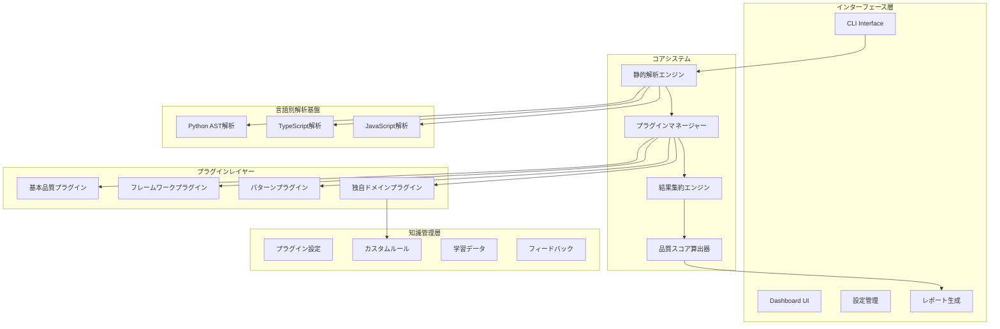

# 静的解析中心のテスト品質監査システム設計レポート（改訂版3.0）

## 1. 概要・設計思想

### 1.1 システム概要

本レポートは、膨大な数のテストコードの品質を効率的に監査するシステムの設計を提案します。**静的解析70-75%＋プラグインベース知識15-20%＋人間判断10%**により、テストの技術的品質と実装機能への適合性を自動検証し、継続的品質改善プロセスを確立します。

**核心価値**
- 静的解析による確実で一貫した品質評価（精度70-75%）
- プラグイン駆動型アーキテクチャによる無限の拡張性
- 組織固有のドメイン知識をプラグイン化できる仕組み
- 暗黙的フィードバックによる継続的改善
- OSSとしての実用性と持続可能性

### 1.2 設計原則

**現実的な処理分担**
```
70-75% 静的解析: 構造・技術・カバレッジの確実な評価
15-20% プラグイン: ドメイン知識・フレームワーク固有・品質パターン
10%    人間判断: ビジネス価値と戦略的判断
```

**プラグイン駆動型アーキテクチャの利点**
```
■ 段階的導入
├─ コア機能だけで即座に価値提供
├─ 必要に応じてプラグイン追加
└─ リスクを抑えた機能拡張

■ 知識の独立性
├─ 各プラグインが独立した知識単位
├─ 組織固有知識の保護
└─ 競合他社との差別化維持

■ 保守性の向上
├─ コアシステムの安定性確保
├─ プラグイン単位での更新
└─ 影響範囲の局所化
```

### 1.3 適合性評価の必要性（Why）

**根本的な問題**
- "正しく書かれたテスト" ≠ "正しいものをテストしているテスト"
- 組織ごとに異なる「正しさ」の基準
- 汎用ツールでは組織固有のニーズに対応不可

**プラグインによる解決**
```yaml
汎用的な品質:
  コアシステムが提供:
    - 構造的品質（テストパターン、命名規約）
    - 技術的品質（複雑度、依存関係）
    - 基本的なカバレッジ

組織固有の品質:
  独自プラグインで実現:
    - 業務ドメイン特有のテスト要件
    - 社内API規約への準拠
    - セキュリティポリシーの遵守
    - パフォーマンス基準の確認
```

## 2. システムアーキテクチャ

### 2.1 プラグイン駆動型アーキテクチャ



### 2.2 プラグインインターフェース設計

**統一されたプラグインインターフェース**
```typescript
interface ITestQualityPlugin {
  // プラグイン識別情報
  id: string;
  name: string;
  version: string;
  type: 'core' | 'framework' | 'pattern' | 'domain';
  
  // プラグインの適用条件
  isApplicable(context: ProjectContext): boolean;
  
  // メイン機能
  detectPatterns(testFile: TestFile): Promise<DetectionResult[]>;
  evaluateQuality(patterns: DetectionResult[]): QualityScore;
  suggestImprovements(evaluation: QualityScore): Improvement[];
  
  // オプション機能
  autoFix?(testFile: TestFile, improvements: Improvement[]): FixResult;
  learn?(feedback: Feedback): void;
}

interface ProjectContext {
  projectType: string;
  languages: string[];
  frameworks: string[];
  customDomain?: string;
  organizationRules?: Record<string, any>;
}
```

### 2.3 プラグインマネージャーの実装

```typescript
class PluginManager {
  private plugins: Map<string, ITestQualityPlugin> = new Map();
  private enabledPlugins: Set<string> = new Set();
  private pluginPriorities: Map<string, number> = new Map();
  
  async loadCorePlugins(): Promise<void> {
    // システム提供の基本プラグインを読み込み
    const corePlugins = [
      new BasicQualityPlugin(),
      new TestStructurePlugin(),
      new CoveragePlugin()
    ];
    
    for (const plugin of corePlugins) {
      this.registerPlugin(plugin, 100); // 高優先度
    }
  }
  
  async loadCustomPlugins(pluginDir: string): Promise<void> {
    // ユーザー定義プラグインを読み込み
    const pluginFiles = await this.scanPluginDirectory(pluginDir);
    
    for (const file of pluginFiles) {
      try {
        const plugin = await this.loadPluginFromFile(file);
        this.validatePlugin(plugin);
        this.registerPlugin(plugin, 50); // 中優先度
      } catch (error) {
        console.warn(`プラグイン読み込みエラー: ${file}`, error);
      }
    }
  }
  
  async runAnalysis(testFile: TestFile, context: ProjectContext): Promise<AnalysisResult> {
    const applicablePlugins = this.getApplicablePlugins(context);
    const pluginResults: PluginResult[] = [];
    
    // 優先度順にプラグインを実行
    for (const plugin of this.sortByPriority(applicablePlugins)) {
      try {
        const result = await this.runPlugin(plugin, testFile);
        pluginResults.push(result);
      } catch (error) {
        this.handlePluginError(plugin, error);
      }
    }
    
    return this.aggregateResults(pluginResults);
  }
}
```

## 3. コアプラグインシステム

### 3.1 基本品質プラグイン（システム提供）

**必要最小限の品質チェック**
```typescript
class BasicQualityPlugin implements ITestQualityPlugin {
  id = 'basic-quality';
  name = 'Basic Test Quality Metrics';
  version = '1.0.0';
  type: 'core' = 'core';
  
  detectPatterns(testFile: TestFile): DetectionResult[] {
    const results: DetectionResult[] = [];
    
    // テストケースの存在確認
    results.push(...this.detectTestCases(testFile));
    
    // アサーションの密度
    results.push(...this.detectAssertions(testFile));
    
    // セットアップ・クリーンアップ
    results.push(...this.detectSetupTeardown(testFile));
    
    return results;
  }
  
  evaluateQuality(patterns: DetectionResult[]): QualityScore {
    const metrics = {
      hasTests: patterns.some(p => p.patternId === 'test-case'),
      assertionDensity: this.calculateAssertionDensity(patterns),
      properCleanup: patterns.some(p => p.patternId === 'cleanup'),
    };
    
    const score = this.calculateScore(metrics);
    
    return {
      overall: score,
      breakdown: metrics,
      confidence: 0.95 // コア機能は高信頼度
    };
  }
}
```

### 3.2 フレームワークプラグイン（オプション）

**フレームワーク固有のベストプラクティス**
```typescript
// プラグインディレクトリ: plugins/frameworks/jest.plugin.ts
export class JestFrameworkPlugin implements ITestQualityPlugin {
  id = 'jest-framework';
  name = 'Jest Best Practices';
  version = '1.0.0';
  type: 'framework' = 'framework';
  
  isApplicable(context: ProjectContext): boolean {
    return context.frameworks.includes('jest') ||
           this.detectJestInProject();
  }
  
  detectPatterns(testFile: TestFile): DetectionResult[] {
    return [
      ...this.detectMockUsage(testFile),
      ...this.detectAsyncPatterns(testFile),
      ...this.detectSnapshotTesting(testFile),
      ...this.detectTestIsolation(testFile)
    ];
  }
  
  private detectMockUsage(testFile: TestFile): DetectionResult[] {
    // Jest特有のモックパターンを検出
    const ast = testFile.getAST();
    const results: DetectionResult[] = [];
    
    ast.traverse({
      CallExpression(path: any) {
        if (this.isJestMock(path)) {
          const hasCleanup = this.checkMockCleanup(path);
          results.push({
            patternId: 'jest-mock-management',
            confidence: hasCleanup ? 0.9 : 0.6,
            location: path.node.loc,
            metadata: { hasCleanup }
          });
        }
      }
    });
    
    return results;
  }
}
```

## 4. 独自ドメインプラグインの作成

### 4.1 なぜ独自ドメインプラグインが必要か

**組織固有の知識の形式化**
```yaml
一般的なツールでは検出できない組織固有の要件:
  
  自社API規約:
    - 独自のエラーコード体系
    - 社内認証トークンの扱い
    - レスポンスフォーマット規約
    
  ビジネスルール:
    - 業界特有の計算ロジック
    - 法規制への準拠要件
    - 社内セキュリティポリシー
    
  技術的制約:
    - レガシーシステムとの互換性
    - パフォーマンス基準
    - 特殊なデプロイ環境
```

### 4.2 独自プラグイン作成ガイド

**ステップ1: プラグインテンプレートから開始**
```typescript
// plugins/domain/my-company-api.plugin.ts
import { ITestQualityPlugin, ProjectContext, TestFile, DetectionResult, QualityScore, Improvement } from '@test-quality/core';

export class MyCompanyApiPlugin implements ITestQualityPlugin {
  id = 'my-company-api';
  name = '自社API品質基準';
  version = '1.0.0';
  type: 'domain' = 'domain';
  
  // このプラグインが適用される条件
  isApplicable(context: ProjectContext): boolean {
    // プロジェクト設定で明示的に有効化された場合
    return context.customDomain === 'my-company-api' ||
           // または特定のディレクトリ構造を持つ場合
           this.detectOurApiProject(context);
  }
  
  // 自社特有のパターンを検出
  async detectPatterns(testFile: TestFile): Promise<DetectionResult[]> {
    const results: DetectionResult[] = [];
    
    // 1. 自社APIのエラーハンドリング規約
    results.push(...this.detectErrorHandling(testFile));
    
    // 2. 認証トークンの適切なテスト
    results.push(...this.detectAuthTokenTesting(testFile));
    
    // 3. レスポンス形式の検証
    results.push(...this.detectResponseValidation(testFile));
    
    // 4. 必須のビジネスルールテスト
    results.push(...this.detectBusinessRules(testFile));
    
    return results;
  }
  
  private detectErrorHandling(testFile: TestFile): DetectionResult[] {
    const results: DetectionResult[] = [];
    const ast = testFile.getAST();
    
    // 自社のエラーコード体系をチェック
    const requiredErrorCodes = [
      'ERR_AUTH_001', // 認証失敗
      'ERR_PERM_001', // 権限不足
      'ERR_VAL_001',  // バリデーションエラー
      'ERR_BIZ_001'   // ビジネスルール違反
    ];
    
    for (const errorCode of requiredErrorCodes) {
      const hasTest = this.findErrorCodeTest(ast, errorCode);
      
      results.push({
        patternId: `error-handling-${errorCode}`,
        confidence: hasTest ? 1.0 : 0.0,
        location: hasTest?.location || null,
        metadata: {
          errorCode,
          tested: hasTest !== null
        }
      });
    }
    
    return results;
  }
  
  evaluateQuality(patterns: DetectionResult[]): QualityScore {
    const errorHandlingScore = this.calculateErrorHandlingScore(patterns);
    const authScore = this.calculateAuthScore(patterns);
    const responseScore = this.calculateResponseScore(patterns);
    const businessRuleScore = this.calculateBusinessRuleScore(patterns);
    
    // 自社の重み付けで総合スコアを計算
    const overall = 
      errorHandlingScore * 0.3 +
      authScore * 0.3 +
      responseScore * 0.2 +
      businessRuleScore * 0.2;
    
    return {
      overall,
      breakdown: {
        errorHandling: errorHandlingScore,
        authentication: authScore,
        responseFormat: responseScore,
        businessRules: businessRuleScore
      },
      confidence: 0.85
    };
  }
  
  suggestImprovements(evaluation: QualityScore): Improvement[] {
    const improvements: Improvement[] = [];
    
    if (evaluation.breakdown.errorHandling < 0.8) {
      improvements.push({
        severity: 'critical',
        category: 'error-handling',
        message: '自社エラーコード体系のテストが不足しています',
        example: `
// 必須: 全てのエラーコードをテスト
describe('API Error Handling', () => {
  it('should return ERR_AUTH_001 for invalid credentials', async () => {
    const response = await api.post('/login', { 
      username: 'invalid', 
      password: 'wrong' 
    });
    
    expect(response.status).toBe(401);
    expect(response.body.error.code).toBe('ERR_AUTH_001');
    expect(response.body.error.message).toMatch(/認証に失敗しました/);
  });
  
  it('should return ERR_PERM_001 for insufficient permissions', async () => {
    const response = await api.get('/admin/users', {
      headers: { Authorization: 'Bearer user_token' }
    });
    
    expect(response.status).toBe(403);
    expect(response.body.error.code).toBe('ERR_PERM_001');
  });
});`
      });
    }
    
    return improvements;
  }
}
```

### 4.3 プラグインの設定と有効化

**プロジェクト設定（.test-quality/config.yml）**
```yaml
# プラグイン駆動型設定
version: "2.0"
architecture: "plugin-based"

# コアプラグイン（常に有効）
core_plugins:
  - id: "basic-quality"
    enabled: true
  - id: "test-structure"
    enabled: true
  - id: "coverage-analysis"
    enabled: true

# オプショナルプラグイン
optional_plugins:
  # フレームワークプラグイン
  - id: "jest-framework"
    enabled: auto  # 自動検出
    config:
      strict_mocking: true
      require_cleanup: true
  
  # パターンプラグイン
  - id: "async-patterns"
    enabled: true
    priority: "medium"

# 独自ドメインプラグイン
custom_plugins:
  - path: "./test-quality-plugins/my-company-api.plugin.ts"
    enabled: true
    priority: "critical"
    config:
      strict_mode: true
      legacy_support: false
  
  - path: "./test-quality-plugins/performance-standards.plugin.ts"
    enabled: true
    priority: "high"
    config:
      response_time_threshold: 200  # ms
      memory_limit: 100  # MB

# プラグイン実行設定
execution:
  parallel: true
  timeout: 30000  # ms per plugin
  continue_on_error: true

# 品質ゲート
quality_gates:
  development:
    min_core_score: 0.6
    min_overall_score: 0.5
    
  staging:
    min_core_score: 0.8
    min_overall_score: 0.7
    required_plugins: ["my-company-api"]
    
  production:
    min_core_score: 0.9
    min_overall_score: 0.85
    required_plugins: ["my-company-api", "performance-standards"]
    zero_critical_issues: true
```

### 4.4 プラグイン開発のベストプラクティス

**1. 単一責任の原則**
```typescript
// ❌ 悪い例: 複数の関心事を1つのプラグインに
class EverythingPlugin {
  detectPatterns() {
    // API、認証、パフォーマンス、セキュリティ...全部
  }
}

// ✅ 良い例: 関心事ごとに分離
class ApiContractPlugin { /* APIの契約に特化 */ }
class AuthSecurityPlugin { /* 認証セキュリティに特化 */ }
class PerformancePlugin { /* パフォーマンスに特化 */ }
```

**2. 設定可能性の提供**
```typescript
interface PluginConfig {
  strictMode?: boolean;
  customRules?: Record<string, any>;
  thresholds?: {
    [key: string]: number;
  };
}

class ConfigurablePlugin implements ITestQualityPlugin {
  constructor(private config: PluginConfig = {}) {}
  
  detectPatterns(testFile: TestFile): DetectionResult[] {
    if (this.config.strictMode) {
      // より厳格なチェック
    }
    // ...
  }
}
```

**3. 明確なエラーメッセージ**
```typescript
suggestImprovements(evaluation: QualityScore): Improvement[] {
  return [{
    severity: 'critical',
    category: 'api-contract',
    message: '必須のAPIレスポンス検証が不足しています',
    
    // 具体的な問題箇所
    location: {
      file: 'api.test.ts',
      line: 45,
      column: 10
    },
    
    // 実行可能な改善例
    example: '/* 実際のコード例 */',
    
    // 理由の説明
    rationale: '自社APIでは全レスポンスにrequest_idが必須です',
    
    // 参考リンク
    documentation: 'https://internal-wiki/api-standards#response'
  }];
}
```

## 5. プラグインエコシステム

### 5.1 プラグインの共有と再利用

**社内プラグインリポジトリ**
```bash
# 社内プラグインの構造
company-test-plugins/
├── domains/
│   ├── billing-domain/      # 請求システム用
│   ├── user-domain/         # ユーザー管理用
│   └── inventory-domain/    # 在庫管理用
├── patterns/
│   ├── api-patterns/        # API共通パターン
│   ├── db-patterns/         # DB関連パターン
│   └── security-patterns/   # セキュリティパターン
└── frameworks/
    ├── internal-framework/  # 社内フレームワーク用
    └── legacy-adapters/     # レガシーシステム用
```

**プラグインのパッケージ化**
```json
// package.json
{
  "name": "@mycompany/test-quality-billing-plugin",
  "version": "2.1.0",
  "main": "dist/index.js",
  "test-quality-plugin": {
    "type": "domain",
    "compatibility": ">=2.0.0",
    "dependencies": ["basic-quality", "async-patterns"]
  },
  "peerDependencies": {
    "@test-quality/core": "^2.0.0"
  }
}
```

### 5.2 プラグイン間の連携

**依存関係の定義**
```typescript
class BillingDomainPlugin implements ITestQualityPlugin {
  dependencies = ['api-contract', 'decimal-precision'];
  
  async initialize(pluginManager: PluginManager) {
    // 依存プラグインの結果を活用
    this.apiPlugin = pluginManager.getPlugin('api-contract');
    this.precisionPlugin = pluginManager.getPlugin('decimal-precision');
  }
  
  detectPatterns(testFile: TestFile): DetectionResult[] {
    // 依存プラグインの結果を組み合わせて高度な検出
    const apiPatterns = this.apiPlugin.getCachedResults(testFile);
    const precisionPatterns = this.precisionPlugin.getCachedResults(testFile);
    
    return this.combinePatternsForBillingDomain(apiPatterns, precisionPatterns);
  }
}
```

## 6. 段階的品質判定システム

### 6.1 プラグインベースの品質判定

```yaml
品質判定の構成:
  コア品質（50%）:
    担当: コアプラグイン
    内容:
      - 基本的なテスト構造
      - アサーションの存在
      - セットアップ/クリーンアップ
    信頼度: 95%以上
    
  拡張品質（30%）:
    担当: フレームワーク/パターンプラグイン
    内容:
      - フレームワーク固有のベストプラクティス
      - 一般的なテストパターン
      - 非同期処理の適切性
    信頼度: 85-90%
    
  ドメイン品質（20%）:
    担当: 独自ドメインプラグイン
    内容:
      - 組織固有のルール
      - ビジネスロジックの検証
      - 規制要件の充足
    信頼度: 90%以上（組織が定義するため）
```

### 6.2 段階的導入のためのモード

```typescript
enum QualityMode {
  // 学習モード: 全プラグインは情報提供のみ
  LEARNING = 'learning',
  
  // アシストモード: コアプラグインのみ必須
  ASSISTED = 'assisted',
  
  // 標準モード: コア＋選択したプラグイン
  STANDARD = 'standard',
  
  // 厳格モード: 全ての有効プラグインが必須
  STRICT = 'strict'
}

class QualityGateManager {
  evaluateGate(results: AnalysisResult, mode: QualityMode): GateResult {
    switch (mode) {
      case QualityMode.LEARNING:
        // 常にパス、ただし改善提案を表示
        return { passed: true, suggestions: results.improvements };
        
      case QualityMode.ASSISTED:
        // コアプラグインの結果のみで判定
        return this.evaluateCoreOnly(results);
        
      case QualityMode.STANDARD:
        // 選択されたプラグインで判定
        return this.evaluateSelected(results);
        
      case QualityMode.STRICT:
        // 全プラグインで判定、Critical項目は必須
        return this.evaluateStrict(results);
    }
  }
}
```

## 7. インターフェース・ユーザー体験

### 7.1 React Inkベースの対話的CLI

```typescript
const InteractiveCLI = () => {
  const [mode, setMode] = useState('dashboard');
  
  return (
    <Box flexDirection="column" height="100%">
      {/* ヘッダー */}
      <Header>
        <Text color="cyan" bold>テスト品質監査システム</Text>
        <Spacer />
        <ModeIndicator mode={mode} />
      </Header>
      
      {/* メインコンテンツ */}
      {mode === 'dashboard' && <AnalysisDashboard />}
      {mode === 'watch' && <WatchMode />}
      {mode === 'plugins' && <PluginManager />}
      {mode === 'report' && <ReportViewer />}
      
      {/* ステータスバー */}
      <StatusBar>
        <KeyboardShortcuts />
        <LastUpdateTime />
      </StatusBar>
    </Box>
  );
};
```

### 7.2 プラグイン中心の解析結果表示

```bash
$ npx test-quality-audit analyze tests/

📊 テスト品質監査レポート (プラグイン駆動型)
═══════════════════════════════════════════════════════════

実行モード: Standard
有効プラグイン: 8個 (コア: 3, フレームワーク: 2, ドメイン: 3)

tests/api/billing.test.ts
├─ 総合品質スコア: 0.78 [信頼度: ★★★★☆]
│
├─ コアプラグイン結果 (必須)
│  ├─ ✅ basic-quality: 0.92
│  ├─ ✅ test-structure: 0.88
│  └─ ⚠️  coverage-analysis: 0.75
│
├─ フレームワークプラグイン結果
│  ├─ ✅ jest-framework: 0.85
│  └─ ✅ async-patterns: 0.90
│
├─ ドメインプラグイン結果
│  ├─ ❌ billing-domain: 0.55 [Critical]
│  │  └─ 問題: 金額計算の精度テストが不足
│  ├─ ⚠️  api-contract: 0.70
│  │  └─ 問題: エラーレスポンス形式の検証不足
│  └─ ✅ performance-standards: 0.95
│
└─ 必須改善項目 (ドメイン: billing-domain より)
   1. 小数点以下の丸め処理テストを追加
   2. 通貨変換時の精度保証テストを追加
   3. 大量計算時のオーバーフロー対策テスト

tests/auth/login.test.ts
├─ 総合品質スコア: 0.91 [信頼度: ★★★★★]
└─ ✅ 全プラグインの基準をクリア
```

### 7.3 プラグイン管理インターフェース

```bash
$ npx test-quality-audit plugin list

📦 インストール済みプラグイン
═══════════════════════════════════════════════════════════

コアプラグイン (システム提供)
├─ basic-quality@1.0.0        [有効] 必須
├─ test-structure@1.0.0       [有効] 必須
└─ coverage-analysis@1.0.0    [有効] 必須

フレームワークプラグイン
├─ jest-framework@1.2.0       [有効] 自動検出
├─ react-testing@2.0.1        [無効] 
└─ pytest-patterns@1.1.0      [無効]

パターンプラグイン
├─ async-patterns@1.3.0       [有効]
├─ api-patterns@2.1.0         [有効]
└─ db-patterns@1.0.5          [無効]

独自ドメインプラグイン
├─ @mycompany/billing@2.1.0   [有効] Critical
├─ @mycompany/api-contract@1.5.0 [有効]
└─ @mycompany/performance@1.2.0  [有効]

$ npx test-quality-audit plugin install @mycompany/security-audit

✅ プラグイン @mycompany/security-audit@1.0.0 をインストールしました
   タイプ: domain
   依存関係: basic-quality, api-patterns
   
プラグインを有効化しますか？ (Y/n) Y
✅ .test-quality/config.yml を更新しました
```

### 7.4 プラグイン作成ウィザード

```bash
$ npx test-quality-audit plugin create

🔧 新規プラグイン作成ウィザード
═══════════════════════════════════════════════════════════

プラグインタイプを選択:
1) domain - ドメイン固有のルール
2) pattern - テストパターン
3) framework - フレームワーク固有
4) quality - 品質メトリクス

選択: 1

プラグイン名: payment-security
説明: 決済セキュリティのテスト品質

検出したいパターンを追加 (完了したらEnter):
1. パターンID: credit-card-masking
   説明: クレジットカード番号のマスキング確認
   
2. パターンID: pci-compliance
   説明: PCI DSS準拠のテスト

✅ プラグインテンプレートを生成しました:
   ./test-quality-plugins/payment-security/
   ├── index.ts
   ├── patterns/
   │   ├── credit-card-masking.ts
   │   └── pci-compliance.ts
   ├── test/
   │   └── plugin.test.ts
   └── README.md

次のステップ:
1. patterns/ 内のファイルに検出ロジックを実装
2. npm test でプラグインをテスト
3. .test-quality/config.yml に追加して有効化
```

## 8. 技術実装詳細

### 8.1 プラグインローダーの実装

```typescript
class PluginLoader {
  private cache = new Map<string, ITestQualityPlugin>();
  
  async loadPlugin(pluginPath: string): Promise<ITestQualityPlugin> {
    // キャッシュチェック
    if (this.cache.has(pluginPath)) {
      return this.cache.get(pluginPath)!;
    }
    
    try {
      // TypeScriptプラグインの場合はトランスパイル
      if (pluginPath.endsWith('.ts')) {
        await this.transpilePlugin(pluginPath);
      }
      
      // プラグインのインポート
      const module = await import(pluginPath);
      const PluginClass = module.default || module[Object.keys(module)[0]];
      
      // インスタンス化
      const plugin = new PluginClass();
      
      // バリデーション
      this.validatePlugin(plugin);
      
      // キャッシュに保存
      this.cache.set(pluginPath, plugin);
      
      return plugin;
    } catch (error) {
      throw new PluginLoadError(`プラグイン読み込みエラー: ${pluginPath}`, error);
    }
  }
  
  private validatePlugin(plugin: any): void {
    const required = ['id', 'name', 'version', 'type', 'detectPatterns', 'evaluateQuality'];
    
    for (const prop of required) {
      if (!(prop in plugin)) {
        throw new Error(`必須プロパティ '${prop}' が不足しています`);
      }
    }
    
    if (!['core', 'framework', 'pattern', 'domain'].includes(plugin.type)) {
      throw new Error(`不正なプラグインタイプ: ${plugin.type}`);
    }
  }
}
```

### 8.2 プラグイン実行の最適化

```typescript
class OptimizedPluginRunner {
  private workerPool: WorkerPool;
  private resultCache: LRUCache<string, PluginResult>;
  
  constructor() {
    this.workerPool = new WorkerPool({ size: os.cpus().length });
    this.resultCache = new LRUCache({ max: 1000 });
  }
  
  async runPluginsParallel(
    plugins: ITestQualityPlugin[],
    testFiles: TestFile[]
  ): Promise<Map<string, PluginResult[]>> {
    const tasks: Promise<[string, PluginResult]>[] = [];
    
    for (const file of testFiles) {
      for (const plugin of plugins) {
        const cacheKey = `${plugin.id}:${file.path}:${file.hash}`;
        
        // キャッシュヒット
        if (this.resultCache.has(cacheKey)) {
          tasks.push(
            Promise.resolve([file.path, this.resultCache.get(cacheKey)!])
          );
          continue;
        }
        
        // 並列実行タスクを追加
        tasks.push(
          this.workerPool.exec(async () => {
            const result = await this.runPlugin(plugin, file);
            this.resultCache.set(cacheKey, result);
            return [file.path, result];
          })
        );
      }
    }
    
    // 結果を集約
    const results = await Promise.all(tasks);
    return this.aggregateByFile(results);
  }
}
```

### 8.3 プラグイン間通信

```typescript
interface IPluginContext {
  // 他のプラグインの結果を参照
  getPluginResult(pluginId: string): PluginResult | undefined;
  
  // 共有データストア
  sharedData: Map<string, any>;
  
  // イベントシステム
  emit(event: string, data: any): void;
  on(event: string, handler: (data: any) => void): void;
}

class PluginContextManager implements IPluginContext {
  private results = new Map<string, PluginResult>();
  private eventEmitter = new EventEmitter();
  sharedData = new Map<string, any>();
  
  getPluginResult(pluginId: string): PluginResult | undefined {
    return this.results.get(pluginId);
  }
  
  emit(event: string, data: any): void {
    this.eventEmitter.emit(event, data);
  }
  
  on(event: string, handler: (data: any) => void): void {
    this.eventEmitter.on(event, handler);
  }
}

// プラグインでの使用例
class IntegrationTestPlugin implements ITestQualityPlugin {
  async detectPatterns(
    testFile: TestFile, 
    context?: IPluginContext
  ): Promise<DetectionResult[]> {
    // 他のプラグインの結果を活用
    const apiPatterns = context?.getPluginResult('api-patterns');
    const dbPatterns = context?.getPluginResult('db-patterns');
    
    if (apiPatterns && dbPatterns) {
      // 統合テストの品質を評価
      return this.evaluateIntegrationTests(apiPatterns, dbPatterns);
    }
    
    return this.basicDetection(testFile);
  }
}
```

## 9. OSS としての持続可能性

### 9.1 最小限のコアと豊富なプラグイン

**コアシステムの責務**
```yaml
コアが提供する機能（変更が少ない）:
  - プラグインインターフェース
  - プラグインローダー
  - 基本的な静的解析基盤
  - 結果集約エンジン
  - CLI/UIフレームワーク

プラグインが提供する機能（自由に拡張）:
  - 具体的な品質チェック
  - ドメイン固有のルール
  - フレームワーク対応
  - カスタムレポート
  - 自動修正機能
```

### 9.2 コミュニティによる成長モデル

**プラグイン貢献の流れ**
```
1. 組織内で独自プラグインを開発
   ↓
2. 汎用的な部分を切り出し
   ↓
3. OSSプラグインとして公開
   ↓
4. コミュニティが改善・拡張
   ↓
5. デファクトスタンダード化
```

**貢献のインセンティブ**
- 自組織の問題解決がそのまま貢献に
- プラグイン作者としての認知
- 他組織のプラグインを利用可能
- ベストプラクティスの共有

### 9.3 プラグインマーケットプレイス構想

```bash
$ npx test-quality-audit plugin search billing

🔍 "billing" の検索結果
═══════════════════════════════════════════════════════════

@community/billing-best-practices (★★★★☆ 4.2)
  ダウンロード: 12,453
  説明: 請求システムの一般的なテストパターン
  
@fintech/payment-compliance (★★★★★ 4.8) 
  ダウンロード: 8,234
  説明: PCI DSS準拠のテスト品質チェック
  
@enterprise/sap-billing-adapter (★★★☆☆ 3.5)
  ダウンロード: 3,421
  説明: SAP請求モジュール向けテスト

$ npx test-quality-audit plugin install @community/billing-best-practices
```

## 10. 導入効果と成功指標

### 10.1 現実的な効果目標

**段階的な価値実現**
```yaml
導入直後（Day 1）:
  - コアプラグインによる基本品質の可視化
  - 改善ポイントの明確化
  - チーム内の議論活性化

1ヶ月後:
  - 独自プラグインの初版完成
  - 組織固有ルールの形式知化
  - レビュー時間20%削減

3ヶ月後:
  - 複数プラグインの連携
  - 品質の定量的改善（スコア15%向上）
  - 新人オンボーディング期間短縮

6ヶ月後:
  - プラグインエコシステムの確立
  - レビュー時間40%削減
  - 本番障害20%削減
```

### 10.2 プラグイン駆動の成功指標

**定量的指標**
```yaml
プラグイン採用率:
  目標: 6ヶ月で5個以上の独自プラグイン
  測定: プラグイン数と利用頻度

品質改善効果:
  目標: 総合品質スコア20%向上
  測定: 導入前後のスコア比較

開発効率:
  目標: テストレビュー時間30%削減
  測定: PRレビュー時間の計測

知識共有:
  目標: 暗黙知の80%を形式知化
  測定: プラグイン化されたルール数
```

### 10.3 段階的成功の定義

```yaml
Phase 1 (0-1ヶ月): 基礎確立
  - コアプラグインでの運用開始
  - 品質の可視化達成
  - チームの理解獲得

Phase 2 (1-3ヶ月): カスタマイズ
  - 初の独自プラグイン作成
  - 既存ルールのプラグイン化
  - 品質基準の明確化

Phase 3 (3-6ヶ月): 最適化
  - 複数プラグインの統合
  - パフォーマンス最適化
  - 他チームへの展開

Phase 4 (6ヶ月以降): エコシステム
  - プラグインの共有・再利用
  - コミュニティ形成
  - 継続的改善サイクル確立
```

## 11. リスク分析と対策

### 11.1 プラグインアーキテクチャのリスク

**プラグイン品質のばらつき**
```yaml
リスク:
  - 低品質プラグインによる誤検知
  - 非互換プラグインの混在
  - パフォーマンス劣化

対策:
  - プラグインバリデーション強化
  - サンドボックス実行環境
  - パフォーマンスモニタリング
  - プラグイン認証制度
```

**複雑性の増大**
```yaml
リスク:
  - プラグイン間の依存関係
  - 設定の複雑化
  - デバッグの困難さ

対策:
  - 依存関係の明示的管理
  - 設定のバリデーション
  - 詳細なログ出力
  - プラグイン単体テスト
```

### 11.2 組織的リスクと対策

**プラグイン開発の負担**
```yaml
リスク:
  - 開発リソース不足
  - メンテナンス負担
  - 知識の属人化

対策:
  - テンプレート・ジェネレーター提供
  - 段階的なプラグイン化
  - ドキュメント自動生成
  - ペアプログラミング推奨
```

## 12. まとめ

### 12.1 プラグイン駆動型アーキテクチャの価値

本システムは、**最小限のコアシステム**と**プラグインによる無限の拡張性**を組み合わせることで、あらゆる組織のテスト品質ニーズに対応可能な設計となっています。

**主要な特徴**
- コアシステムは安定した基盤機能のみ提供
- プラグインで組織固有の知識を形式化
- 段階的導入による低リスクな展開
- コミュニティによる継続的改善

**独自性**
- 組織の暗黙知をプラグイン化する明確な方法論
- プラグイン間の協調による高度な品質評価
- OSSとして持続可能なエコシステム設計

**期待される成果**
- 即座に価値を提供（コアプラグイン）
- 組織固有ニーズへの完全な対応（独自プラグイン）
- 知識の形式化と共有促進
- 継続的な品質向上サイクル確立

この設計により、「汎用ツールでは対応できない組織固有のテスト品質要求」という根本的な課題を、プラグインという拡張可能な仕組みで解決し、各組織が自らの品質基準を定義・実装・改善できる実用的なシステムを実現します。