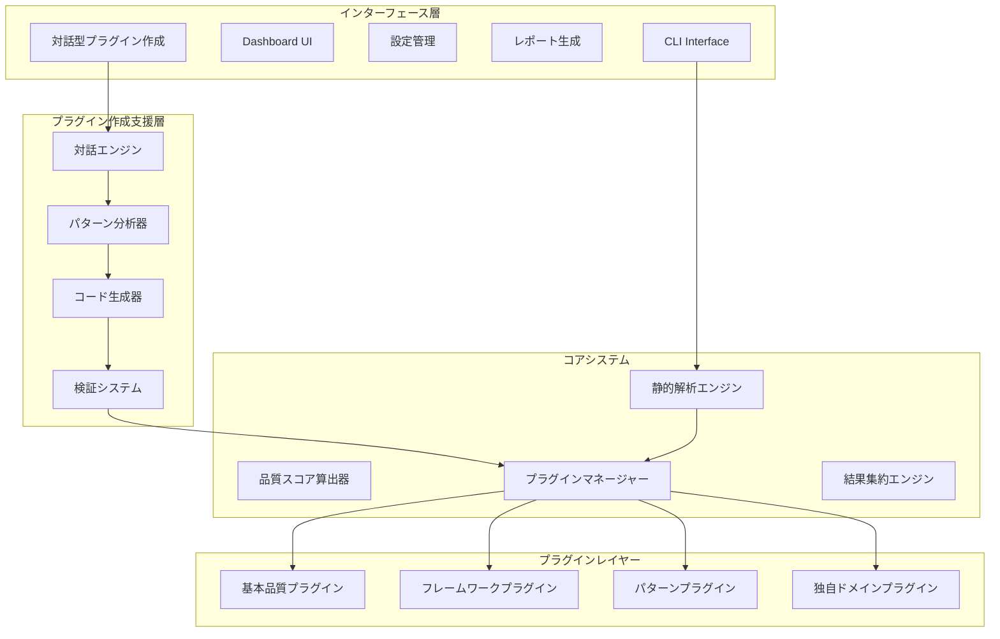

# 静的解析中心のテスト品質監査システム設計レポート（改訂版4.0）

## 1. 概要・設計思想

### 1.1 システム概要

本レポートは、膨大な数のテストコードの品質を効率的に監査するシステムの設計を提案します。**静的解析70-75%＋プラグインベース知識15-20%＋人間判断10%**により、テストの技術的品質と実装機能への適合性を自動検証し、継続的品質改善プロセスを確立します。

**核心価値**
- 静的解析による確実で一貫した品質評価（精度70-75%）
- プラグイン駆動型アーキテクチャによる無限の拡張性
- **対話型プラグイン作成による知識の民主化**
- 組織固有のドメイン知識をプラグイン化できる仕組み
- 暗黙的フィードバックによる継続的改善
- OSSとしての実用性と持続可能性

### 1.2 設計原則

**現実的な処理分担**
```
70-75% 静的解析: 構造・技術・カバレッジの確実な評価
15-20% プラグイン: ドメイン知識・フレームワーク固有・品質パターン
10%    人間判断: ビジネス価値と戦略的判断
```

**プラグイン作成の民主化**
```
■ 技術的障壁の除去
├─ 対話型インターフェースによる要件定義
├─ サンプルコードからの自動パターン抽出
└─ 段階的な複雑性の導入

■ 知識の形式化支援
├─ 自然言語での品質基準記述
├─ ビジュアルなパターン確認
└─ 即座のフィードバック

■ 継続的な改善
├─ 生成されたプラグインの学習材料化
├─ コミュニティでの知識共有
└─ ベストプラクティスの蓄積
```

### 1.3 適合性評価の必要性（Why）

**根本的な問題**
- "正しく書かれたテスト" ≠ "正しいものをテストしているテスト"
- 組織ごとに異なる「正しさ」の基準
- 汎用ツールでは組織固有のニーズに対応不可
- **プラグイン作成の技術的ハードルが高い**（新たに認識）

**対話型システムによる解決**
```yaml
従来のプラグイン作成:
  問題点:
    - TypeScript/JavaScriptの深い知識が必要
    - AST解析の理解が前提
    - デバッグが困難
    
対話型プラグイン作成:
  解決策:
    - 自然言語で要件を記述
    - サンプルコードから自動学習
    - リアルタイムでの動作確認
```

## 2. システムアーキテクチャ

### 2.1 拡張されたプラグイン駆動型アーキテクチャ



### 2.2 プラグインインターフェース設計（変更なし）

**統一されたプラグインインターフェース**
```typescript
interface ITestQualityPlugin {
  // プラグイン識別情報
  id: string;
  name: string;
  version: string;
  type: 'core' | 'framework' | 'pattern' | 'domain';
  
  // プラグインの適用条件
  isApplicable(context: ProjectContext): boolean;
  
  // メイン機能
  detectPatterns(testFile: TestFile): Promise<DetectionResult[]>;
  evaluateQuality(patterns: DetectionResult[]): QualityScore;
  suggestImprovements(evaluation: QualityScore): Improvement[];
  
  // オプション機能
  autoFix?(testFile: TestFile, improvements: Improvement[]): FixResult;
  learn?(feedback: Feedback): void;
}
```

### 2.3 対話型プラグイン作成システム

**設計思想**
- 技術的な詳細を隠蔽し、ビジネス要件に集中
- 段階的な詳細化で複雑性を管理
- 即座のフィードバックで理解を促進

**システム構成**
```yaml
対話型プラグイン作成システム:
  入力層:
    - 自然言語での要件記述
    - サンプルコードの提供
    - 対話的な詳細化
    
  処理層:
    - 要件の意図理解
    - パターンの自動抽出
    - 類似プラグインの提案
    
  出力層:
    - プラグインの自動生成
    - 動作確認とテスト
    - 最適化提案
```

## 3. コアプラグインシステム

### 3.1 基本品質プラグイン（システム提供）

必要最小限の品質チェックを提供し、すべてのプロジェクトで即座に価値を提供。
```typescript
class BasicQualityPlugin implements ITestQualityPlugin {
  id = 'basic-quality';
  name = 'Basic Test Quality Metrics';
  version = '1.0.0';
  type: 'core' = 'core';
  
  detectPatterns(testFile: TestFile): DetectionResult[] {
    const results: DetectionResult[] = [];
    
    // テストケースの存在確認
    results.push(...this.detectTestCases(testFile));
    
    // アサーションの密度
    results.push(...this.detectAssertions(testFile));
    
    // セットアップ・クリーンアップ
    results.push(...this.detectSetupTeardown(testFile));
    
    return results;
  }
  
  evaluateQuality(patterns: DetectionResult[]): QualityScore {
    const metrics = {
      hasTests: patterns.some(p => p.patternId === 'test-case'),
      assertionDensity: this.calculateAssertionDensity(patterns),
      properCleanup: patterns.some(p => p.patternId === 'cleanup'),
    };
    
    const score = this.calculateScore(metrics);
    
    return {
      overall: score,
      breakdown: metrics,
      confidence: 0.95 // コア機能は高信頼度
    };
  }
}
```

### 3.2 フレームワークプラグイン（オプション）

主要なテストフレームワークに対応したベストプラクティスを提供。
```typescript
// プラグインディレクトリ: plugins/frameworks/jest.plugin.ts
export class JestFrameworkPlugin implements ITestQualityPlugin {
  id = 'jest-framework';
  name = 'Jest Best Practices';
  version = '1.0.0';
  type: 'framework' = 'framework';
  
  isApplicable(context: ProjectContext): boolean {
    return context.frameworks.includes('jest') ||
           this.detectJestInProject();
  }
  
  detectPatterns(testFile: TestFile): DetectionResult[] {
    return [
      ...this.detectMockUsage(testFile),
      ...this.detectAsyncPatterns(testFile),
      ...this.detectSnapshotTesting(testFile),
      ...this.detectTestIsolation(testFile)
    ];
  }
  
  private detectMockUsage(testFile: TestFile): DetectionResult[] {
    // Jest特有のモックパターンを検出
    const ast = testFile.getAST();
    const results: DetectionResult[] = [];
    
    ast.traverse({
      CallExpression(path: any) {
        if (this.isJestMock(path)) {
          const hasCleanup = this.checkMockCleanup(path);
          results.push({
            patternId: 'jest-mock-management',
            confidence: hasCleanup ? 0.9 : 0.6,
            location: path.node.loc,
            metadata: { hasCleanup }
          });
        }
      }
    });
    
    return results;
  }
}
```

## 4. 対話型プラグイン作成システム

### 4.1 なぜ対話型システムが必要か

**従来の課題**
```yaml
技術的障壁:
  - プラグインAPIの学習コスト
  - プログラミング知識の必要性
  - デバッグの困難さ
  
知識ギャップ:
  - 何を検出すべきかは分かるが、どう実装するか分からない
  - サンプルコードはあるが、パターン化できない
  - 既存プラグインの改造方法が不明
```

**対話型システムの価値**
```yaml
アクセシビリティ:
  - 品質管理者も直接プラグインを作成可能
  - 段階的な学習が可能
  - 即座の価値実現
  
知識の形式化:
  - 暗黙知を対話を通じて明確化
  - ベストプラクティスの自動提案
  - 組織知識の蓄積
```

### 4.2 対話フローの設計

**Phase 1: 目的の理解**
```
システム: どのようなテスト品質をチェックしたいですか？
ユーザー: 決済処理でカード番号が適切にマスクされているか確認したい

システム: 理解した内容:
         - カテゴリ: セキュリティ
         - 対象: 決済処理
         - チェック内容: データマスキング
         この理解で正しいですか？
```

**Phase 2: 具体例の収集**
```
システム: 良いテストの例を見せていただけますか？
ユーザー: [サンプルコードを提供]

システム: 以下のパターンを検出しました：
         ✓ カード番号形式の検証
         ✓ マスキング結果の確認
         ✓ 元データの非露出
         他にチェックしたい項目はありますか？
```

**Phase 3: ルールの詳細化**
```
システム: エラー時の扱いはどうしますか？
         1. エラーとして報告
         2. 警告として報告
         3. カスタマイズ可能にする

ユーザー: 3を選択

システム: デフォルトの重要度は？
         - Critical（必須）
         - High（推奨）
         - Medium（任意）
```

**Phase 4: 確認と生成**
```
システム: プラグインの設定内容:
         名前: payment-security
         検出パターン: 3個
         重要度: カスタマイズ可能（デフォルト: High）
         
         この内容でプラグインを生成しますか？
```

### 4.3 パターン学習と提案

**自動パターン認識**
```yaml
サンプルコード分析:
  入力:
    - ユーザー提供のテストコード
    - 良い例/悪い例の区別
    
  処理:
    - AST解析による構造理解
    - パターンの共通性抽出
    - 統計的な特徴抽出
    
  出力:
    - 検出可能なパターン一覧
    - 信頼度スコア
    - 追加提案
```

**類似プラグインからの学習**
```yaml
推奨システム:
  - 既存プラグインとの類似度計算
  - 適用可能なパターンの提案
  - カスタマイズポイントの明確化
```

### 4.4 生成されるプラグインの品質保証

**段階的な複雑性**
```yaml
Level 1 - 単純なパターンマッチ:
  - 文字列パターンの検出
  - 基本的な条件判定
  - 固定メッセージ

Level 2 - 構造化された検証:
  - AST レベルの検証
  - 複数条件の組み合わせ
  - コンテキスト考慮

Level 3 - 高度なロジック:
  - プラグイン間連携
  - 学習機能
  - 自動修正提案
```

## 5. プラグインエコシステムの拡張

### 5.1 プラグインの共有と発見

**プラグインテンプレートライブラリ**
```bash
一般的なユースケース:
├── セキュリティ/
│   ├── データマスキング
│   ├── 認証チェック
│   └── 入力検証
├── パフォーマンス/
│   ├── 応答時間
│   ├── メモリ使用量
│   └── 並行処理
└── ビジネスロジック/
    ├── 計算精度
    ├── 状態遷移
    └── 境界値
```

### 5.2 コミュニティ駆動の改善

**プラグイン進化のサイクル**
```
1. 対話型作成で初版生成
   ↓
2. 実使用でのフィードバック収集
   ↓
3. コミュニティでの改善提案
   ↓
4. ベストプラクティス化
   ↓
5. テンプレートライブラリへの追加
```

## 6. 段階的品質判定システム（拡張）

### 6.1 プラグイン作成難易度を考慮した品質判定

```yaml
品質判定の構成:
  コア品質（50%）:
    作成難易度: なし（システム提供）
    カバー範囲: 基本的な品質
    
  設定ベース品質（20%）:
    作成難易度: 低（設定ファイルのみ）
    カバー範囲: 単純なパターン
    
  対話作成品質（20%）:
    作成難易度: 中（対話型作成）
    カバー範囲: 組織固有ルール
    
  高度なカスタム（10%）:
    作成難易度: 高（コーディング必要）
    カバー範囲: 複雑なロジック
```

### 6.2 組織の成熟度に応じた活用モデル

```yaml
Stage 1 - 導入期:
  - コアプラグインのみ使用
  - 基本的な品質可視化
  - チームの意識向上

Stage 2 - 成長期:
  - 設定ベースプラグイン追加
  - 対話型で初のカスタムプラグイン
  - 知識の形式化開始

Stage 3 - 成熟期:
  - 複数のカスタムプラグイン運用
  - プラグイン間の連携
  - 組織知識の体系化

Stage 4 - 最適化期:
  - 高度なカスタマイズ
  - 他チームへの展開
  - エコシステムへの貢献
```

## 7. ユーザー体験の設計

### 7.1 対話型プラグイン作成の体験

```bash
$ npx test-quality-audit plugin create --interactive

🧙 プラグイン作成アシスタント
━━━━━━━━━━━━━━━━━━━━━━━━━━━━━━━━━━━━━━━━━━

ようこそ！いくつかの質問に答えるだけで、
カスタムプラグインを作成できます。

? どのようなテスト品質をチェックしたいですか？
> APIのエラーハンドリングが適切に行われているか確認したい

理解しました。APIのエラーハンドリングについて、
もう少し詳しく教えてください。

? 特に重要視する点は何ですか？（複数選択可）
> ◉ HTTPステータスコードの検証
> ◉ エラーメッセージの確認
> ○ リトライ処理の実装
> ◉ ログ出力の確認

? 良いテストの例はありますか？
> はい（エディタが開きます）

[サンプルコード入力...]

✨ パターンを分析しました

検出されたパターン:
- ✓ expect(response.status).toBe(XXX) の使用
- ✓ エラーオブジェクトの構造検証
- ✓ console.errorの呼び出し確認

? これらのパターンをすべてチェックしますか？
> カスタマイズする

[対話的な調整...]

🎉 プラグインを生成しました！

📁 ./plugins/api-error-handling/
├── index.ts         # メインプラグイン
├── config.yml       # 設定ファイル
├── examples/        # サンプルコード
└── README.md        # 使用方法

? このプラグインをテストしますか？
> はい

[テスト実行とフィードバック...]
```

### 7.2 継続的な改善体験

```bash
$ npx test-quality-audit plugin improve api-error-handling

📊 プラグイン使用統計
━━━━━━━━━━━━━━━━━━━━━━━━━━━━━━━━━━━━━━━━━━

使用回数: 1,234回
検出した問題: 89個
誤検知率: 12%

💡 改善提案:

1. 誤検知の削減
   "response.error"を含むが、エラーハンドリングではない
   ケースが12件ありました。
   
   → コンテキストを考慮した検出に改善しますか？

2. 新しいパターンの検出
   最近のコードで "catch (error)"ブロックでの
   エラーハンドリングが増えています。
   
   → このパターンも検出対象に追加しますか？

? どの改善を適用しますか？
> 両方適用する

[対話的な改善プロセス...]
```

## 8. 技術実装の方向性

### 8.1 対話エンジンの設計思想

**アーキテクチャ概要**
```yaml
対話エンジン:
  コンポーネント:
    - 意図理解モジュール
    - コンテキスト管理
    - 質問生成ロジック
    - 回答検証システム
    
  設計原則:
    - ステートレスな対話フロー
    - プラガブルな質問テンプレート
    - 学習可能な回答パターン
```

### 8.2 パターン分析の仕組み

**分析フロー**
```yaml
入力分析:
  1. 構文解析（AST生成）
  2. パターン抽出
  3. 統計的特徴の計算
  4. 類似パターンの検索
  
出力生成:
  1. パターンの一般化
  2. 検出ルールの生成
  3. 信頼度の算出
  4. 最適化提案
```

### 8.3 プラグイン検証システム

**品質保証プロセス**
```yaml
自動検証:
  - 構文チェック
  - サンプルコードでの動作確認
  - パフォーマンステスト
  - 既存プラグインとの競合チェック
  
フィードバックループ:
  - 実行時メトリクス収集
  - 誤検知/見逃しの記録
  - 改善提案の自動生成
```

## 9. 導入効果と成功指標

### 9.1 対話型システムによる改善効果

**プラグイン作成の民主化**
```yaml
従来:
  作成者: 開発者のみ
  作成時間: 2-3日
  必要スキル: TypeScript, AST解析
  成功率: 30%

対話型導入後:
  作成者: QAエンジニア、品質管理者も可能
  作成時間: 30分-1時間
  必要スキル: ドメイン知識のみ
  成功率: 80%
```

### 9.2 測定可能な成功指標

**定量的指標**
```yaml
採用指標:
  - プラグイン作成者の多様性
  - 作成されたプラグイン数
  - プラグインの再利用率
  
品質指標:
  - 検出精度の向上率
  - 誤検知率の低下
  - カバレッジの拡大
  
効率指標:
  - プラグイン作成時間
  - メンテナンスコスト
  - 知識共有の速度
```

### 9.3 段階的な価値実現

```yaml
即時効果（1週間）:
  - 最初のカスタムプラグイン作成
  - チーム固有のルール形式化
  - 品質意識の向上

短期効果（1ヶ月）:
  - 複数プラグインの運用
  - 品質スコアの改善
  - レビュー効率化

中期効果（3ヶ月）:
  - 組織知識の体系化
  - 新人教育の効率化
  - 品質の安定化

長期効果（6ヶ月以降）:
  - プラグインエコシステムの確立
  - ベストプラクティスの共有
  - 継続的改善文化の定着
```

## 10. リスク分析と対策

### 10.1 対話型システムのリスク

**品質リスク**
```yaml
リスク:
  - 不適切なパターンの生成
  - 過度に単純化されたルール
  - 誤った一般化
  
対策:
  - 生成後の人的レビュー
  - サンドボックスでのテスト
  - 段階的なロールアウト
```

**運用リスク**
```yaml
リスク:
  - プラグインの乱立
  - メンテナンス負荷
  - 品質のばらつき
  
対策:
  - プラグインガバナンス
  - 自動テストの必須化
  - 定期的な棚卸し
```

### 10.2 組織的な対策

**ガバナンス体制**
```yaml
プラグイン管理委員会:
  役割:
    - 品質基準の策定
    - 重複チェック
    - ベストプラクティス選定
    
  活動:
    - 月次レビュー
    - 改善提案
    - 知識共有会
```

## 11. 実装ロードマップ

### 11.1 段階的な機能リリース

**Phase 1: 基礎機能（Month 1-2）**
```yaml
実装内容:
  - コアプラグインシステム
  - 基本的な静的解析
  - シンプルなCLI
  
成果:
  - 即座の価値提供
  - 基本的な品質可視化
```

**Phase 2: 対話型システム（Month 3-4）**
```yaml
実装内容:
  - 対話型プラグイン作成
  - パターン分析エンジン
  - サンプルベース学習
  
成果:
  - プラグイン作成の民主化
  - 知識の形式化促進
```

**Phase 3: エコシステム（Month 5-6）**
```yaml
実装内容:
  - プラグインマーケットプレイス
  - コミュニティ機能
  - 高度な分析機能
  
成果:
  - 知識の共有と再利用
  - 継続的改善の確立
```

## 12. まとめ

### 12.1 革新的な価値提案

本システムは、**静的解析の確実性**と**プラグインの拡張性**に加え、**対話型プラグイン作成による知識の民主化**を実現します。

**三つの革新**
1. **技術的革新**: 高精度な静的解析とプラグインアーキテクチャ
2. **プロセス革新**: 対話型システムによるプラグイン作成の簡素化
3. **組織的革新**: 暗黙知の形式化と知識共有の促進

**期待される成果**
- 品質管理の専門家も直接プラグインを作成可能
- 組織固有の品質基準を迅速に実装
- 知識の蓄積と共有による継続的改善
- テスト品質の飛躍的向上

この設計により、「テスト品質の自動監査」という技術的課題を、組織全体で取り組める身近な改善活動に変革し、ソフトウェア品質の新しいスタンダードを確立します。