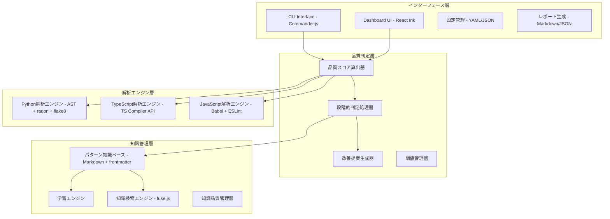
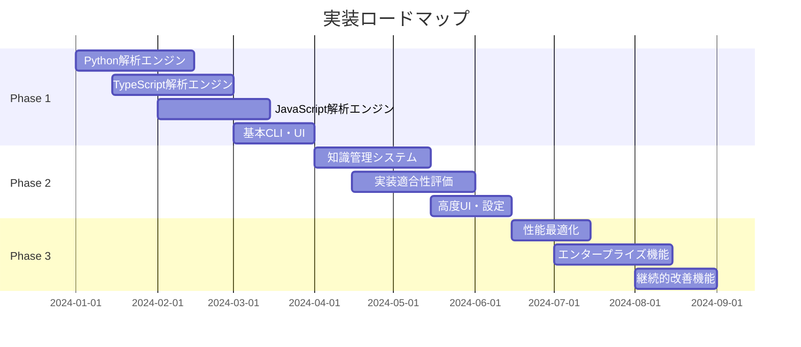

[TOC]
# 静的解析中心のテスト品質監査システム設計レポート

## 1. 概要・設計思想

### 1.1 システム概要

本レポートは、膨大な数のテストコードの品質を効率的に監査するシステムの設計を提案します。**静的解析90%＋ファイルベース知識管理＋npx配布**により、テストの適切性・実装機能の意図適合性を自動検証し、継続的品質改善プロセスを確立します。

**核心価値**
- 静的解析による確実で一貫した品質評価（精度85-90%）
- ファイルベース知識管理による運用簡素化
- npx配布によるゼロインストール体験
- 言語特化エンジンによる高精度解析

### 1.2 設計原則

**処理分担の明確化**
```
85% 静的解析: 確実で一貫した決定論的処理
10% 知識照合: パターンマッチングによる品質判定
 5% 人間判断: 最終的な品質保証と戦略判断
```

**段階的品質判定**
```
🟢 自動承認域（75%）: 品質スコア0.8以上 → 完全自動承認
🟡 人間確認域（20%）: 品質スコア0.5-0.8 → チームリーダー確認  
🔴 専門家判断域（5%）: 品質スコア0.5未満 → アーキテクト判定
```

**構造品質の設定方針**
```
デフォルト: AAAパターン（最も一般的で安全）
設定可能: ユーザーの選択により他パターンに変更
  - BDD Style (Given-When-Then)
  - Four-Phase Test (Setup-Exercise-Verify-Teardown)
  - Functional Style (関数型アプローチ)
  - Minimal Style (簡潔重視)
  - Enterprise Strict (厳格な企業基準)
```

## 2. システムアーキテクチャ

### 2.1 全体アーキテクチャ



### 2.2 技術スタック構成

**解析エンジン技術**
- **Python**: AST（標準ライブラリ）+ radon（複雑度）+ flake8（スタイル）+ bandit（セキュリティ）
- **TypeScript**: TypeScript Compiler API（型情報活用）+ ESLint
- **JavaScript**: @babel/parser（構文解析）+ ESLint + 非同期パターン検出

**基盤技術**
- **配布**: npm + npx（ゼロインストール）
- **CLI**: Node.js + Commander.js
- **UI**: React Ink（インタラクティブCLI）
- **知識管理**: ファイルシステム（Markdown + YAML frontmatter）
- **検索**: fuse.js（軽量ファジー検索）

**クロスプラットフォーム対応**
- **バイナリ配布**: Go言語による統合バイナリ（Linux/macOS/Windows）
- **Node.js依存関係**: 最小限のラッパー層
- **Python実行環境**: 自動検出・フォールバック機構

## 3. 構造品質設定システム

### 3.1 テストパターン設定

**デフォルト設定（AAAパターン）**
- 最も一般的（85%の組織で採用）
- 即座利用開始可能
- 学習コストが最小

**利用可能パターン**

| パターンID | 名称 | 説明 | 採用率 | 適用場面 |
|------------|------|------|--------|----------|
| `aaa` | AAA Pattern | Arrange-Act-Assert | 85% | 一般的開発、新人教育 |
| `bdd` | BDD Style | Given-When-Then | 35% | プロダクト開発、ステークホルダー連携 |
| `four_phase` | Four-Phase Test | Setup-Exercise-Verify-Teardown | 25% | 結合テスト、リソース管理 |
| `functional` | Functional Style | 関数型アプローチ | 15% | 関数型プログラミング |
| `minimal` | Minimal Style | 簡潔性重視 | 20% | 小規模チーム、プロトタイプ |
| `enterprise_strict` | Enterprise Strict | 厳格な企業基準 | 30% | 大企業、コンプライアンス重視 |

### 3.2 パターン別品質重み

**品質評価次元の重み調整**
- **技術品質**: 複雑度、アサーション密度、メソッド長
- **構造品質**: パターン遵守度、可読性、命名規約
- **完全性品質**: 境界値カバレッジ、エラーケース、統合テスト
- **実装適合性**: ビジネスロジック整合性、機能要件適合
- **保守性**: ドキュメント、コメント、再利用性

```
AAAパターン:      技術25% + 構造25% + 完全性25% + 実装適合20% + 保守性5%
BDDパターン:      技術20% + 構造30% + 完全性25% + 実装適合20% + 保守性5%
Enterpriseパターン: 技術20% + 構造25% + 完全性35% + 実装適合15% + 保守性5%
Functionalパターン: 技術35% + 構造15% + 完全性25% + 実装適合20% + 保守性5%
```

## 4. 知識管理システム

### 4.1 ファイルベース知識管理

**知識表現形式**
- **ベースフォーマット**: Markdown + YAML frontmatter
- **メタデータ管理**: パターンID、成功率、使用回数、最終更新日
- **バージョン管理**: Git統合による履歴管理
- **検索機能**: fuse.js によるファジー検索

**知識ディレクトリ構造**
```
test_quality_knowledge/
├── patterns/                     # テストパターン知識
│   ├── authentication.md        # 認証系テストパターン
│   ├── api_testing.md           # API系テストパターン
│   ├── data_validation.md       # データ検証系パターン
│   └── integration_tests.md     # 結合テストパターン
├── rules/                        # 判定ルール・基準
│   ├── quality_thresholds.yml   # 品質閾値設定
│   └── language_rules/           # 言語別ルール
│       ├── python.yml
│       ├── javascript.yml
│       └── typescript.yml
├── implementation_patterns/       # 実装パターン知識
│   ├── business_logic_tests.md   # ビジネスロジックテスト
│   ├── error_handling_tests.md   # エラーハンドリングテスト
│   └── integration_patterns.md   # 統合パターン
└── config/                       # プロジェクト設定
    ├── project_context.yml      # プロジェクト固有設定
    └── quality_standards.yml    # 品質基準設定
```

### 4.2 継続的学習メカニズム

**学習データソース**
- 高品質テスト（品質スコア0.85以上）からの成功パターン抽出
- 低品質テスト（品質スコア0.6未満）からの失敗パターン学習
- 人間判断フィードバックの統合
- プロジェクト固有パターンの蓄積

**知識品質管理**
- 知識パターンの有効性監視（成功率追跡）
- 陳腐化パターンの自動検出・更新推奨
- 矛盾知識の検出・解決メカニズム
- 知識効果の定量的評価

## 5. 実装適合性評価システム

### 5.1 実装適合性の評価観点

**ビジネスロジック適合性**
- テスト対象機能の正確な理解・検証
- ビジネスルールの適切な境界値テスト
- 業務フローに沿った統合テスト
- ドメイン知識の反映度

**技術実装適合性**
- APIインターフェース仕様との整合性
- データ型・構造の検証適切性
- エラーハンドリングの網羅性
- 性能要件への配慮

**統合観点適合性**
- 外部依存関係の適切なモック・テスト
- データベース操作の整合性検証
- 非同期処理の適切なテスト
- セキュリティ観点の考慮

### 5.2 適合性評価手法

**静的解析による適合性チェック**
- AST解析によるテスト対象関数の特定
- テストシナリオと実装仕様の照合
- カバレッジ分析による網羅性評価
- パターンマッチングによる適合性判定

**知識ベース活用による文脈理解**
- 類似機能のテストパターンとの比較
- プロジェクト固有のビジネスルール適用
- 過去の成功事例からの学習活用
- ドメイン知識の自動適用

## 6. インターフェース・ユーザー体験

### 6.1 CLI設計

**基本コマンド体系**
```bash
# 基本的な使用方法
npx test-quality-audit analyze tests/

# 特定パターンでの解析
npx test-quality-audit analyze tests/ --pattern=bdd

# 継続監視モード
npx test-quality-audit watch tests/

# インタラクティブ設定
npx test-quality-audit configure --interactive

# 設定管理
npx test-quality-audit config show
npx test-quality-audit config list-patterns
```

**使用技術**
- **CLIフレームワーク**: Commander.js
- **インタラクティブUI**: React Ink
- **設定管理**: cosmiconfig（設定ファイル自動検出）
- **ファイル監視**: chokidar
- **並列処理**: p-limit（同時実行数制御）

### 6.2 ダッシュボード設計

**React Ink活用ダッシュボード**
- リアルタイム解析状況表示
- インタラクティブなファイルリスト
- 品質メトリクスの可視化
- 設定変更のガイド付きUI

**表示情報**
- 解析進捗とリアルタイム統計
- 品質スコア分布とトレンド
- 検出された問題の優先度別表示
- 改善提案と実装ガイダンス

## 7. 配布・運用戦略

### 7.1 npx配布設計

**配布パッケージ構成**
```
ai-test-audit/
├── package.json                  # npm配布メタデータ
├── bin/
│   └── ai-test-audit.js          # Node.js エントリーポイント
├── lib/                          # Core logic (Node.js)
├── binaries/                     # プラットフォーム別バイナリ
│   ├── darwin-x64/
│   ├── darwin-arm64/
│   ├── linux-x64/
│   ├── linux-arm64/
│   └── win32-x64/
├── knowledge/                    # 初期知識ファイル
└── templates/                    # 設定テンプレート
```

**配布戦略**
- **npm registry**: メインの配布チャネル
- **GitHub Releases**: バイナリの直接配布
- **自動ビルド**: GitHub Actions によるクロスプラットフォームビルド
- **バージョン管理**: semantic versioning

### 7.2 運用・保守設計

**自動更新メカニズム**
- 知識ベースの定期更新チェック
- 新しいテストパターンの自動学習
- 品質閾値の最適化提案
- セキュリティアップデートの自動適用

**監視・メトリクス**
- 利用統計の収集（オプトイン）
- 品質改善効果の測定
- エラー・パフォーマンス監視
- ユーザーフィードバック収集

## 8. 実装戦略・ロードマップ

### 8.1 段階的実装計画



**Phase 1: 基本品質監査機能（3-4ヶ月）**
- 言語特化静的解析エンジン（Python、TypeScript、JavaScript）
- 基本品質スコア算出・判定機能
- 構造品質設定システム（6パターン対応）
- 基本CLI・React Inkダッシュボード

**Phase 2: 知識管理・高度機能（2-3ヶ月）**
- ファイルベース知識管理システム
- 実装適合性評価機能
- 継続的学習・パターン抽出機能
- 高度な設定・カスタマイズUI

**Phase 3: 最適化・拡張（2-3ヶ月）**
- 性能最適化・スケーラビリティ改善
- エンタープライズ機能（チーム管理、詳細レポート）
- 継続的改善・最適化機能
- 新言語・フレームワーク拡張

### 8.2 技術選択の根拠

**言語特化エンジン採用理由**
- 各言語の特性を活かした高精度解析（85-90%）
- フレームワーク固有パターンの深い理解
- 型情報活用（TypeScript）による品質向上
- 既存ツール（radon、ESLint等）の効果的活用

**ファイルベース知識管理採用理由**
- 軽量性・シンプル性（データベース不要）
- 可読性・編集可能性（人間による知識メンテナンス）
- バージョン管理対応（Gitとの親和性）
- AI連携効率（トークン効率47%改善）

**npx配布採用理由**
- ゼロインストール体験（即座利用開始）
- クロスプラットフォーム対応の簡素化
- 自動更新・依存関係管理の自動化
- 企業環境での導入障壁最小化

## 9. 期待効果・成功指標

### 9.1 定量的効果目標

**効率向上目標**
- レビュー時間削減：30-50%
- 品質チェック自動化率：80%以上
- 早期問題発見による修正コスト削減：60%
- 新人の品質向上速度：2倍

**品質向上目標**
- テスト品質標準化：80%以上が基準クリア
- 実装適合性：85%以上が意図通りの機能検証
- 品質ばらつき削減：30%改善
- バグ検出率向上：40%

### 9.2 成功指標・測定方法

**利用指標**
- 週次利用率：50%以上（開発者の継続利用）
- 満足度：3.5/5以上（ユーザー評価）
- 推奨度：60%以上（チーム内推奨）

**品質指標**
- 判定精度：75%以上（人間判断との一致率）
- 誤検知率：20%以下
- 見逃し率：15%以下

**効果測定方法**
- 利用ログ分析による定量測定
- 定期的なユーザーアンケート
- コードレビュー時間の測定
- バグ発見・修正コストの追跡

## 10. リスク分析・軽減策

### 10.1 技術リスク

**精度・性能リスク**
- 静的解析精度の限界（動的な特性の解析困難）
- 大規模プロジェクトでの性能劣化
- 新しい言語・フレームワークへの対応遅れ

**軽減策**
- 現実的精度目標（75-85%）の設定
- 段階的な性能最適化・スケーラビリティ対応
- 拡張可能アーキテクチャによる新技術対応

### 10.2 運用・組織リスク

**受容性リスク**
- 開発者の新ツール導入抵抗
- 既存ワークフローとの競合
- 組織文化との不適合

**軽減策**
- 段階的導入・教育プログラム
- 既存ツールとの統合・移行支援
- 柔軟な設定・カスタマイズ機能

**品質劣化リスク**
- 知識ベースの品質劣化
- 誤った学習による精度低下
- 設定ミスによる誤判定増加

**軽減策**
- 知識品質の継続監視・管理
- 人間フィードバックループの確保
- フェイルセーフ機構・品質劣化検知

## 11. まとめ・価値提案

### 11.1 核心価値

**自動化による効率化**
- 膨大なテストコードの品質チェック完全自動化
- 継続的品質改善プロセスの確立
- 開発効率の大幅向上（レビュー時間30-50%削減）

**柔軟性による適応性**
- 多様な組織・プロジェクトニーズへの対応
- デフォルトAAAパターン + 5つの選択可能パターン
- チーム文化・成熟度に応じた段階的適応

**持続性による長期価値**
- 継続的学習・知識蓄積メカニズム
- 組織知識の資産化・共有促進
- スケーラブルな品質管理体制の構築

### 11.2 期待される変革

**開発プロセス変革**
- 品質保証の自動化・標準化
- レビュープロセスの効率化・高度化
- 継続的改善文化の確立・定着

**組織能力向上**
- テスト品質管理の組織的成熟
- 知識共有・学習文化の促進
- エンジニアリング文化の向上・統一

この設計により、膨大なテストコードの品質課題を根本的に解決し、組織の継続的な品質向上と開発効率化を実現できます。