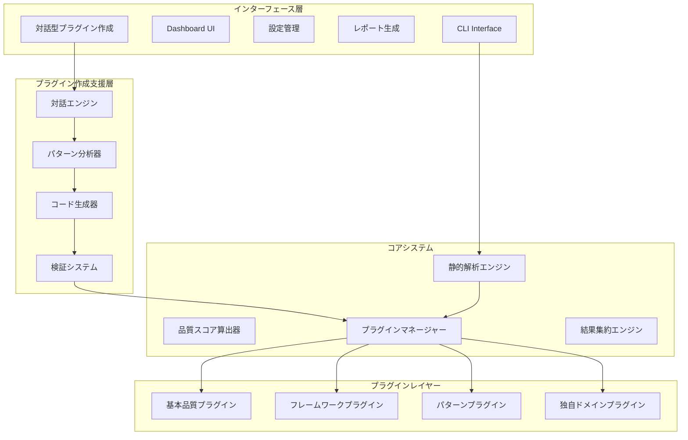
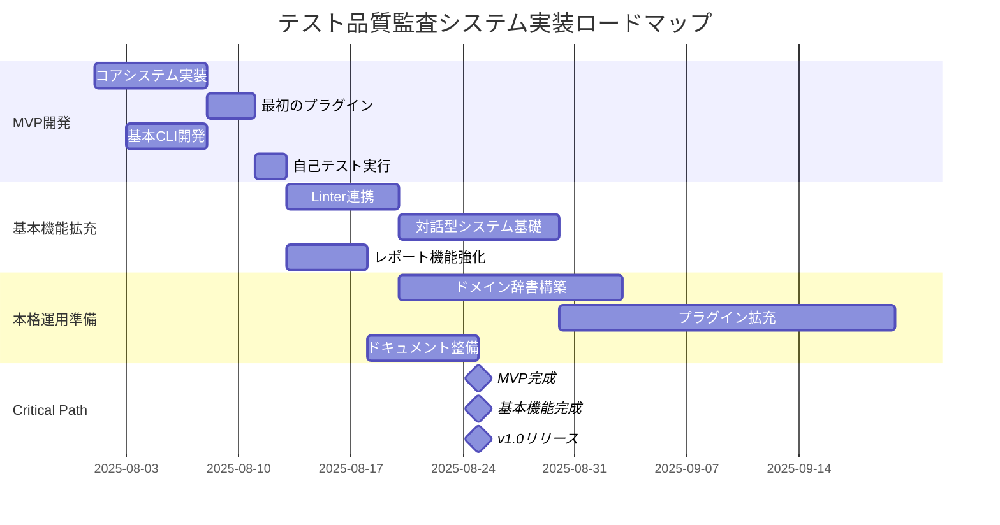

# 静的解析中心のテスト品質監査システム設計レポート（統合版）

## 第1章：エグゼクティブサマリー

### 1.1 システムの価値提案

本システムは、**静的解析の確実性**と**プラグイン型の拡張性**、そして**対話型プラグイン作成による知識の民主化**という3つの革新を実現します。

**核心価値**
- 静的解析による確実で一貫した品質評価（精度70-75%）
- プラグイン駆動型アーキテクチャによる無限の拡張性
- **対話型プラグイン作成による知識の民主化**
- 組織固有のドメイン知識をプラグイン化できる仕組み
- 暗黙的フィードバックによる継続的改善
- OSSとしての実用性と持続可能性

### 1.2 段階的な価値実現のロードマップ

```yaml
即時効果（1週間）:
  - 最初のカスタムプラグイン作成
  - チーム固有のルール形式化
  - 品質意識の向上

短期効果（1ヶ月）:
  - 複数プラグインの運用
  - 品質スコアの改善
  - レビュー効率化

中期効果（3ヶ月）:
  - 組織知識の体系化
  - 新人教育の効率化
  - 品質の安定化

長期効果（6ヶ月以降）:
  - プラグインエコシステムの確立
  - ベストプラクティスの共有
  - 継続的改善文化の定着
```

## 第2章：システムアーキテクチャ

### 2.1 プラグイン駆動型アーキテクチャ



### 2.2 統一プラグインインターフェース

```typescript
interface ITestQualityPlugin {
  // プラグイン識別情報
  id: string;
  name: string;
  version: string;
  type: 'core' | 'framework' | 'pattern' | 'domain';
  
  // プラグインの適用条件
  isApplicable(context: ProjectContext): boolean;
  
  // メイン機能
  detectPatterns(testFile: TestFile): Promise<DetectionResult[]>;
  evaluateQuality(patterns: DetectionResult[]): QualityScore;
  suggestImprovements(evaluation: QualityScore): Improvement[];
  
  // オプション機能
  autoFix?(testFile: TestFile, improvements: Improvement[]): FixResult;
  learn?(feedback: Feedback): void;
}
```

### 2.3 AI向け出力形式の設計

```typescript
interface AIOptimizedOutput {
  version: string;
  format: "ai-optimized";
  metadata: {
    projectType: string;
    language: string;
    testFramework: string;
    timestamp: string;
  };
  
  context: {
    rootPath: string;
    configFiles: Record<string, string>;
    dependencies: Record<string, string>;
  };
  
  files: Array<{
    path: string;
    language: string;
    issues: Array<{
      id: string;
      type: string;
      severity: string;
      location: LocationInfo;
      fix: {
        type: string;
        targetLocation: string;
        code: CodeSnippet;
      };
    }>;
  }>;
  
  actionableTasks: Array<{
    id: string;
    priority: number;
    type: string;
    automatable: boolean;
    steps: ActionStep[];
  }>;
}
```

## 第3章：実装アプローチ - MVP から本格運用まで

### 3.1 MVP（2週間）の実装計画

```typescript
// MVP: わずか100行程度のコアシステム
class TestQualityAuditMVP {
  private plugins: IPlugin[] = [];
  
  async analyze(targetPath: string): Promise<Report> {
    const files = await this.findTestFiles(targetPath);
    const results = [];
    
    for (const file of files) {
      for (const plugin of this.plugins) {
        const issues = await plugin.analyze(file);
        results.push({ file, plugin: plugin.name, issues });
      }
    }
    
    return this.generateReport(results);
  }
}

// 最初のプラグイン（これだけ！）
class TestExistencePlugin implements IPlugin {
  name = 'test-existence';
  
  async analyze(filePath: string): Promise<Issue[]> {
    const srcFile = filePath.replace('.test.', '.').replace('__tests__/', '');
    
    if (!fs.existsSync(filePath)) {
      return [{
        type: 'missing-test',
        severity: 'error',
        message: `テストファイルが存在しません: ${srcFile}`
      }];
    }
    
    return [];
  }
}
```

### 3.2 実装ロードマップ



### 3.3 自己改善サイクル

```bash
# MVPができたら即座に自プロジェクトに適用
$ npm run build
$ node dist/cli.js analyze ./src

📊 テスト品質監査レポート (MVP版)
━━━━━━━━━━━━━━━━━━━━━━━━

src/core/analyzer.ts
  ❌ テストファイルが存在しません

src/plugins/test-existence.ts  
  ✅ テスト存在

カバレッジ: 50% (1/2 ファイル)
```

### 3.4 毎日の改善サイクル

```yaml
Day 1-2: MVP実装
Day 3: 自プロジェクトに適用
  発見した問題:
    - TypeScriptファイルが認識されない
    - パスの解決が不正確
  即座に修正 → v0.0.2

Day 4: チームメンバーが試用
  フィードバック:
    - "設定ファイルがないとエラー"
    - "結果が見づらい"
  改善 → v0.0.3

Day 5: 最初の実用的プラグイン追加
  "assertion-exists": expect文の存在確認
  自プロジェクトで検証 → 15個の不足を発見
```

## 第4章：対話型プラグイン作成システム

### 4.1 なぜ対話型システムが必要か

**従来の課題**
```yaml
技術的障壁:
  - プラグインAPIの学習コスト
  - プログラミング知識の必要性
  - デバッグの困難さ
  
知識ギャップ:
  - 何を検出すべきかは分かるが、どう実装するか分からない
  - サンプルコードはあるが、パターン化できない
  - 既存プラグインの改造方法が不明
```

### 4.2 対話フローの設計

```bash
$ npx test-quality-audit plugin create --interactive

🧙 プラグイン作成アシスタント
━━━━━━━━━━━━━━━━━━━━━━━━━━━━━━━━━━━━━━━━━━

ようこそ！いくつかの質問に答えるだけで、
カスタムプラグインを作成できます。

? どのようなテスト品質をチェックしたいですか？
> APIのエラーハンドリングが適切に行われているか確認したい

理解しました。APIのエラーハンドリングについて、
もう少し詳しく教えてください。

? 特に重要視する点は何ですか？（複数選択可）
> ◉ HTTPステータスコードの検証
> ◉ エラーメッセージの確認
> ○ リトライ処理の実装
> ◉ ログ出力の確認

? 良いテストの例はありますか？
> はい（エディタが開きます）

[サンプルコード入力...]

✨ パターンを分析しました

検出されたパターン:
- ✓ expect(response.status).toBe(XXX) の使用
- ✓ エラーオブジェクトの構造検証
- ✓ console.errorの呼び出し確認
```

### 4.3 ハイブリッドアプローチの実装

```typescript
class ClaudeCodeStyleWizard {
  private templates: TemplateLibrary;
  private patternMatcher: PatternMatcher;
  private codeAnalyzer: CodeAnalyzer;
  
  async createPlugin(): Promise<void> {
    console.log(chalk.bold('\n🧙 プラグイン作成アシスタント\n'));
    
    // ステップ1: 目的の理解
    const purpose = await this.askPurpose();
    
    // ステップ2: サンプルコードの分析
    const samples = await this.askForSamples(purpose);
    
    // ステップ3: パターンの確認
    const patterns = await this.confirmPatterns(samples);
    
    // ステップ4: 詳細設定
    const details = await this.askDetails(patterns);
    
    // ステップ5: 生成と確認
    const plugin = await this.generatePlugin(purpose, patterns, details);
    await this.confirmAndRefine(plugin);
  }
}
```

### 4.4 コンテキスト抽出とルール生成

```typescript
class ContextExtractor {
  extractContext(input: string): Context {
    // Step 1: 文の構造解析
    const parsed = this.parseStructure(input);
    
    // Step 2: ドメイン特定
    const domain = this.identifyDomain(parsed);
    
    // Step 3: 意図の明確化
    const intent = this.clarifyIntent(parsed, domain);
    
    // Step 4: 制約条件の抽出
    const constraints = this.extractConstraints(parsed);
    
    return { domain, intent, constraints };
  }
}
```

## 第5章：知識基盤の構築と成長

### 5.1 Linterからの初期辞書構築

```bash
$ npx test-quality-audit dictionary import-linters

🔍 Linter知識インポートツール
━━━━━━━━━━━━━━━━━━━━━━━━━━━━━

検出されたプロジェクト設定:
- 言語: JavaScript/TypeScript
- Linter: ESLint (設定ファイル: .eslintrc.json)

? インポートする知識を選択:
> ☑ ESLint 基本ルール (283個)
> ☑ プロジェクトの.eslintrc設定 (42個有効)
> ☑ typescript-eslint ルール (108個)
> ☐ コミュニティプリセット (Airbnb, Standard等)

インポート中...
✓ 433個のルールから品質概念を抽出
✓ 1,250個の用語を辞書に追加
✓ 156個のテストパターンを生成
```

### 5.2 ブートストラップ問題の解決

```bash
$ npx test-quality-audit init --bootstrap

🚀 ドメイン辞書ブートストラップモード
━━━━━━━━━━━━━━━━━━━━━━━━━━━━━━

辞書がまだありません。一緒に作りましょう！

? あなたのプロジェクトで最もよくテストするものは何ですか？
> API

? APIの何をテストしていますか？（複数回答可）
> ☑ レスポンスのステータスコード
> ☑ エラーメッセージ
> ☐ レスポンスタイム
> ☑ データの形式

? 実際のテストコードを1つ見せてください
> test('should return 404 for non-existent user', async () => {
>   const response = await api.get('/users/999999');
>   expect(response.status).toBe(404);
>   expect(response.body.error).toBe('User not found');
> });

素晴らしい！このテストから以下を学習しました：
- ドメイン: API/HTTP
- チェック項目: ステータスコード、エラーメッセージ
- パターン: 存在しないリソースのテスト
```

### 5.3 ユーザー主導のルール生成

```typescript
class JustInTimePluginGenerator {
  async generateFromActiveRules() {
    // 1. 実際の設定を読む
    const eslintConfig = await readConfig('.eslintrc.json');
    
    // 2. 有効なルールのみ抽出
    const activeRules = extractActiveRules(eslintConfig);
    
    // 3. 各ルールの実際の設定を反映
    const plugins = activeRules.map(rule => {
      return generatePlugin(rule, {
        config: eslintConfig.rules[rule.name],
        version: eslintConfig.eslintVersion,
        extends: eslintConfig.extends
      });
    });
    
    return plugins; // 必要最小限
  }
}
```

## 第6章：独自価値の創出戦略

### 6.1 静的解析との差別化

**静的解析は「形」を見る、ドメイン知識は「意味」を理解する**

```typescript
// 静的解析が見るもの
function processPayment(amount: number) {
  // 静的解析: 「numberという型」「関数」「引数1個」
}

// ドメイン知識が理解するもの
function processPayment(amount: number) {
  // ドメイン: 「決済処理」「金額」「PCI DSS対象」
  // 追加チェック: 
  // - 負の金額のテストは存在するか？
  // - 小数点以下の精度は適切か？
  // - 通貨単位の考慮はあるか？
}
```

### 6.2 ドメイン知識の成熟度モデル

```yaml
Level 0 - 静的解析の複製（Week 0）:
  特徴: Linterルールをそのまま使用
  価値: ほぼゼロ（重複）

Level 1 - 意味の追加（Week 1-2）:
  特徴: 技術的パターンに業務的意味を付与
  価値: 20%

Level 2 - 文脈理解（Week 3-4）:
  特徴: コードの意図を理解し、不足を検出
  価値: 50%

Level 3 - ドメイン固有（Month 2）:
  特徴: 業界・組織特有の要件を理解
  価値: 80%

Level 4 - 予測的品質（Month 3+）:
  特徴: 将来の問題を予測し、予防的テストを提案
  価値: 100%
```

### 6.3 金融ドメインの実装例

```typescript
class FinancialDomainPlugin implements ITestQualityPlugin {
  detectPatterns(testFile: TestFile): DetectionResult[] {
    const issues = [];
    
    if (isInterestCalculation(testFile)) {
      // 1. 閏年の考慮
      if (!hasTest('leap year calculation')) {
        issues.push({
          severity: 'critical',
          message: '閏年での日割り計算が異なります（365日 vs 366日）',
          required_test: `
            test('閏年での利息計算', () => {
              const leapYearInterest = calculateInterest(10000, 0.03, 366);
              const normalYearInterest = calculateInterest(10000, 0.03, 365);
              expect(leapYearInterest).toBeGreaterThan(normalYearInterest);
            });
          `
        });
      }
    }
    
    return issues;
  }
}
```

## 第7章：ユーザー体験設計

### 7.1 CLI での表示

```bash
$ npx test-quality-audit analyze ./src

🔍 テスト品質監査レポート
━━━━━━━━━━━━━━━━━━━━━━━━━━━━━━━━━━━━━━━━━━━

📊 総合評価
├─ 品質スコア: 72/100 [=======---] C
├─ 分析対象: 156 ファイル
├─ 実行時間: 3.2秒
└─ 検出された問題: 38件（Critical: 5, High: 12, Medium: 21）

⚠️  重要な問題（要対応）
├─ 🔴 [Critical] 決済処理のエラーハンドリングテスト不足（5箇所）
├─ 🔴 [Critical] 非同期処理でawait漏れ（3箇所）
└─ 🟡 [High] APIレスポンスの検証不足（12箇所）

詳細を見る: npx test-quality-audit show details
修正を適用: npx test-quality-audit fix --interactive
```

### 7.2 多様な出力フォーマット

```json
{
  "summary": {
    "score": 72,
    "grade": "C",
    "totalFiles": 156,
    "totalIssues": 38,
    "criticalIssues": 5,
    "executionTime": 3200
  },
  "issues": [
    {
      "id": "payment-security-001",
      "severity": "critical",
      "file": "src/api/payment.test.ts",
      "line": 23,
      "plugin": "payment-security",
      "message": "決済セキュリティテスト不足",
      "suggestedFix": {
        "code": "it('should reject negative amounts', async () => {...})",
        "automated": true
      }
    }
  ]
}
```

### 7.3 CI/CD統合

```yaml
# .github/workflows/test-quality.yml
- name: Run Test Quality Audit
  run: npx test-quality-audit analyze --format=github

# 出力例（GitHub形式のアノテーション）
::error file=src/api/payment.test.ts,line=23,col=1::Critical: 決済セキュリティテスト不足
```

## 第8章：技術実装ガイド

### 8.1 実装者向けクイックスタート

**30分で動くデモ**
```bash
# Step 1: インストール（5分）
$ git clone https://github.com/example/test-quality-audit
$ cd test-quality-audit
$ npm install

# Step 2: ビルドと初回実行（10分）
$ npm run build
$ npm link
$ test-quality-audit init

# Step 3: 最初の分析（5分）
$ test-quality-audit analyze ./sample-project

# Step 4: プラグイン作成（10分）
$ test-quality-audit plugin create --guided
```

**最初の1週間のタスクリスト**
```yaml
Day 1:
  - 環境構築とサンプル実行
  - コードベースの理解
  
Day 2-3:
  - 最小限のプラグイン作成
  - 自プロジェクトでの実行
  
Day 4-5:
  - 対話型システムの試用
  - 基本的な辞書構築
  
Day 6-7:
  - チームへの展開準備
  - ドキュメント作成
```

### 8.2 必要な技術スタック

```json
{
  "dependencies": {
    "@typescript-eslint/parser": "^5.0.0",
    "chalk": "^5.0.0",
    "prompts": "^2.4.0",
    "yargs": "^17.0.0",
    "ora": "^6.0.0"
  },
  "devDependencies": {
    "typescript": "^5.0.0",
    "jest": "^29.0.0",
    "@types/node": "^18.0.0"
  }
}
```

### 8.3 コア機能の実装詳細

```typescript
// プラグインマネージャーの実装
class PluginManager {
  private plugins: Map<string, ITestQualityPlugin> = new Map();
  
  async loadPlugins(pluginDir: string): Promise<void> {
    const files = await fs.readdir(pluginDir);
    
    for (const file of files) {
      if (file.endsWith('.plugin.js')) {
        const plugin = await import(path.join(pluginDir, file));
        this.registerPlugin(plugin.default);
      }
    }
  }
  
  registerPlugin(plugin: ITestQualityPlugin): void {
    if (!this.validatePlugin(plugin)) {
      throw new Error(`Invalid plugin: ${plugin.name}`);
    }
    
    this.plugins.set(plugin.id, plugin);
  }
}
```

### 8.4 テンプレート集

**基本的なプラグインテンプレート**
```typescript
export class CustomPlugin implements ITestQualityPlugin {
  id = 'custom-plugin';
  name = 'Custom Quality Check';
  version = '1.0.0';
  type: 'domain' = 'domain';
  
  isApplicable(context: ProjectContext): boolean {
    // 適用条件を定義
    return true;
  }
  
  async detectPatterns(testFile: TestFile): Promise<DetectionResult[]> {
    const results: DetectionResult[] = [];
    
    // パターン検出ロジック
    
    return results;
  }
  
  evaluateQuality(patterns: DetectionResult[]): QualityScore {
    // 品質評価ロジック
    return {
      overall: 80,
      breakdown: {},
      confidence: 0.9
    };
  }
  
  suggestImprovements(evaluation: QualityScore): Improvement[] {
    // 改善提案の生成
    return [];
  }
}
```

## 第9章：導入と運用

### 9.1 組織への段階的導入

```yaml
Phase 1 - パイロット（1-2週間）:
  対象: 1チーム（5-10名）
  目標: 基本機能の検証
  成果: フィードバック収集
  
Phase 2 - 部門展開（1ヶ月）:
  対象: 1部門（30-50名）
  目標: プラグインの拡充
  成果: 部門固有ルールの確立
  
Phase 3 - 全社展開（3ヶ月）:
  対象: 全開発チーム
  目標: 標準化と定着
  成果: 品質基準の統一
```

### 9.2 メトリクスと成功指標

```yaml
定量的指標:
  - テストカバレッジの向上率
  - バグ発見率の改善
  - コードレビュー時間の短縮
  - プラグイン作成数
  
定性的指標:
  - チームの品質意識向上
  - 知識共有の活性化
  - 新人の立ち上がり速度
  
測定方法:
  - 週次レポートの自動生成
  - アンケートによる満足度調査
  - インシデント数の追跡
```

### 9.3 継続的改善プロセス

```yaml
週次サイクル:
  月曜: 前週の分析結果レビュー
  火水木: 新規プラグイン開発/改善
  金曜: 成果共有と次週計画
  
月次サイクル:
  - プラグインの棚卸し
  - 辞書の更新と整理
  - ベストプラクティスの文書化
  
四半期サイクル:
  - 全社品質基準の見直し
  - 新技術への対応検討
  - ロードマップの更新
```

---

## 統合の基本原則：一貫性の確保

**用語の統一**
- プラグイン（拡張機能という表現は使用しない）
- テスト品質監査（品質チェック、品質検証などの混在を避ける）
- 対話型システム（インタラクティブ、会話型などの表現を統一）

**アーキテクチャ図の整合性**
- すべての図でコンポーネント名を統一
- 色使いとスタイルの一貫性
- mermaid記法の統一

**実装例の一貫性**
- TypeScriptを主言語として統一
- 命名規則の統一（camelCase）
- エラーハンドリングパターンの統一

---

本設計レポートは、静的解析の確実性とプラグインによる拡張性、そして対話型システムによる知識の民主化を実現する、実践的なテスト品質監査システムの構築指針です。段階的な実装アプローチにより、初日から価値を提供しながら、組織のテスト品質を継続的に向上させることが可能となります。